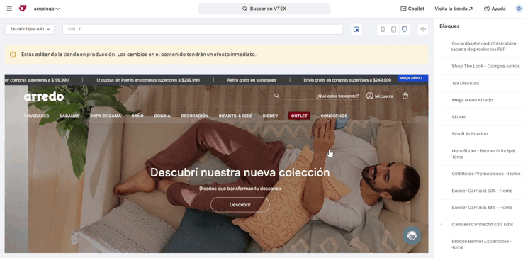

---
metaLinks:
  alternates:
    - >-
      https://app.gitbook.com/s/72B6lE7Nn0jKtcyB10gI/administracion-del-front-del-sitio/uso-del-site-editor/banner-principal
---

# Banner principal - Home

## Pasos para la configuración

1. Ingresar a **Storefront > Site editor.**&#x20;
2. Utilizar la herramienta del puntero y seleccionar el bloque del banner principal, o bien podemos buscar e ingresar al bloque llamado **Hero Slider - Banner principal home.**

<figure><figcaption></figcaption></figure>

3.  Al ingresar al bloque nos mostrará todos los banners que tengamos cargados y la opción para agregar más. **Recomendamos no cargar más de 3 o 4 banners.** 

    <figure><figcaption></figcaption></figure>
4. Si ingresamos a editar uno de los banners cargados, podemos ver las opciones a configurar:
   1. **Mostrar imagen:** Permite administrar si ese banner se mostrará (azul) o no (gris) en el bloque de desktop.&#x20;
   2. **Mostrar en mobile:** Permite administrar si ese banner se mostrará (azul) o no (gris) en el bloque de mobile.&#x20;
   3. **Identificador:** Se debe completar con el nombre con el que se identificará ese banner.&#x20;
   4. **Tipo de contenido:** Se podrá elegir entre imagen o video dependiendo del tipo de archivo que queramos mostrar.&#x20;
   5. **Título:** Si se completa el título, se mostrará encima de la imagen.&#x20;
   6.  **Imagen desktop:** Se debe cargar la imagen que se visualizará en desktop. 

       <figure><figcaption></figcaption></figure>
   7. **Imagen mobile:** Se debe cargar la imagen que se visualizará en mobile.
   8. **ALT/Descripción:** Se debe completar con el texto descriptivo de la imagen.&#x20;
   9. **URL de la ancla:** Se debe completar con la URL a la que redirigirá el banner al hacerle click.
   10. **Target del ancla:** Se debe elegir entre "blank" para que la URL abra en una nueva pestaña o _"_&#x73;elf" para que la URL abra en la misma pestaña.&#x20;
   11. **Carga de la imagen:** Se puede elegir entre "Lazy" (diferida) o "Eager" (inmediata).&#x20;
   12. **Prioridad de la carga:** Se puede elegir entre "Auto", "Alto" y "Bajo".&#x20;
   13. **Pre-cargar imagen:** Se puede activar o no esta opción para pre-cargar la imagen.&#x20;
   14. **Activar analytics:** En caso de activar esta opción, se deben cargar las opciones de la promoción. 

       <figure><figcaption></figcaption></figure>

       1. **ID de promoción:** Se debe completar con el identificador único de la promoción para GA.
       2. **Nombre de la promoción:** Se debe completar con el nombre descriptivo de la promoción.
       3. **Posición de promoción:** Se debe completar con el identificador del bloque
       4. **ID de producto:** Completar en caso que la promoción está asociada a un producto.
       5.  **Nombre de producto:** Completar con el nombre del producto en caso que la promoción está asociada a un producto. 

           <figure><figcaption></figcaption></figure>
   15. **Título:** Se deberá completar con el título que se visualizará en el banner de mobile.&#x20;
   16. **Subtitulo:** Se deberá completar con el subtítulo que se visualizará en el banner de mobile.&#x20;
   17. **Texto del botón:** Se deberá completar con el texto que se visualizará en el botón de la imagen en mobile.&#x20;
   18. **Mostrar en mobile?:** En caso de activar esta opción, se mostrará el botón de "Ver más"
   19. **URL del botón:** Se debe completar con la URL que redirigirá el botón.&#x20;
   20. **Target del ancla?:** Se debe elegir entre "blank" para que la URL abra en una nueva pestaña o _"_&#x73;elf" para que la URL abra en la misma pestaña.&#x20;
   21. **Legales:** Se podrá completar con las aclaraciones pertinentes de legales.  

       <figure><figcaption></figcaption></figure>
   22. **Etiqueta SEO del título:** Se podrá elegir entre H1, H2, H3, H4, párrafo o span.&#x20;
   23. **Etiqueta SEO del subtítulo:** Se podrá elegir entre H2, H3, H4, párrafo o span.&#x20;
   24. **Fecha de inicio:** Se deberá completar con la fecha de inicio de visualización del banner.
   25. **Fecha de fin:** Se deberá completar con la fecha de finalización de visualización del banner.
   26. **Días en que se repite:** Se deben elegir los días en los que se repetirá la visualización del banner entre las fechas seleccionadas.  

       <figure><figcaption></figcaption></figure>
