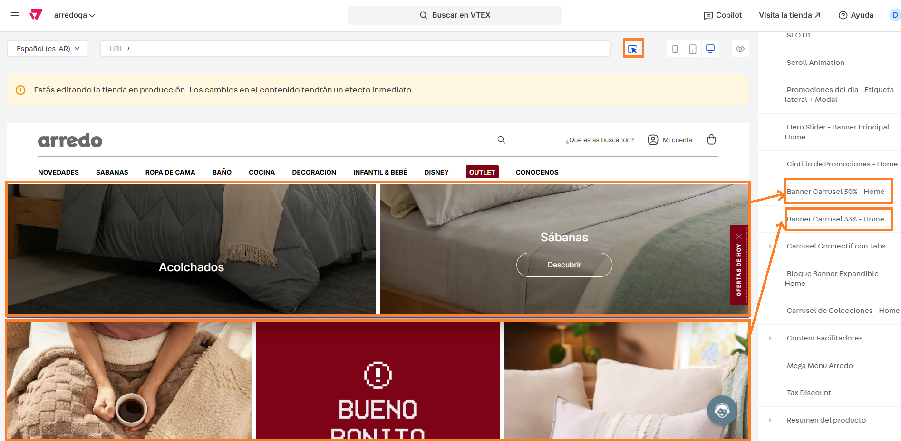
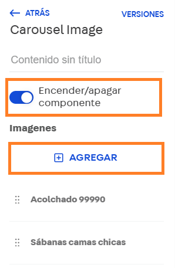

# Bloque de carruseles de banner

## Descripción

Este componente permita cargar en un carrusel hasta tres banners para comunicar categorías o subcategorías de relevancia con la posibilidad de redirigir a una colección o categoría del sitio.&#x20;


Si bien es un carrusel, para asegurar su correcto funcionamiento, no se recomienda subir más de 3 banners ya que podría afectar a la visualización de los elementos&#x20;



Esta configuración aplica tanto para el bloque de Banners al 50% y 33%


## Pasos para la configuración

1. Ingresar a **Storefront > Site editor.**&#x20;
2.  Utilizar la herramienta del puntero y seleccionar el bloque de carrusel de banners, o bien podemos buscar e ingresar al bloque que queramos editar. Para este caso, puede ser el bloque llamado **Banner Carrusel 50% - Home** o **Banner Carrusel 33% - Home** dependiendo cuál queramos editar. Para este ejemplo, ingresaremos al primero pero aplica para ambos. 

    <figure><figcaption></figcaption></figure>
3.  Al ingresar al bloque, nos encontramos con las configuraciones a realizar:

    1. **Encender/Apagar componente?:** Desde esta sección podemos administrar el encendido y aapgado del componente, independientemente si el mismo tiene información cargada.&#x20;
    2.  **Imágenes > Agregar:** Desde esta botón podemos sumar las imágenes que se visualizarán en el carrusel. Recordar cargar 2 imáganes como máximo para el carrusel al 50% y 3 imágenes para el de 33% 

        <figure><figcaption></figcaption></figure>

    3.  Más abajo, encontrarán otras configuraciones de transición pero recomendamos dejar las opciones configuradas por default para asegurar una correcta visualización.  

        <figure><figcaption></figcaption></figure>

4. Si ingresamos por alguna de las imágenes ya cargadas, podemos ver las configuraciones específicas de ese banner. Las mismas son similares a las del banner principal:
   1. **Mostrar imagen:** Permite administrar si ese banner se mostrará (azul) o no (gris) en el bloque de desktop.&#x20;
   2. **Mostrar en mobile:** Permite administrar si ese banner se mostrará (azul) o no (gris) en el bloque de mobile.&#x20;
   3. **Identificador:** Se debe completar con el nombre con el que se identificará ese banner.&#x20;
   4. **Tipo de contenido:** Se podrá elegir entre imagen o video dependiendo del tipo de archivo que queramos mostrar.&#x20;
   5. **Título:** Si se completa el título, se mostrará encima de la imagen.&#x20;
   6.  **Imagen desktop:** Se debe cargar la imagen que se visualizará en desktop. 

       <figure><figcaption></figcaption></figure>
   7. **Imagen mobile:** Se debe cargar la imagen que se visualizará en mobile.
   8. **ALT/Descripción:** Se debe completar con el texto descriptivo de la imagen.&#x20;
   9. **URL de la ancla:** Se debe completar con la URL a la que redirigirá el banner al hacerle click.
   10. **Target del ancla:** Se debe elegir entre "blank" para que la URL abra en una nueva pestaña o _"_&#x73;elf" para que la URL abra en la misma pestaña.&#x20;
   11. **Carga de la imagen:** Se puede elegir entre "Lazy" (diferida) o "Eager" (inmediata).&#x20;
   12. **Prioridad de la carga:** Se puede elegir entre "Auto", "Alto" y "Bajo".&#x20;
   13. **Pre-cargar imagen:** Se puede activar o no esta opción para pre-cargar la imagen.&#x20;
   14. **Activar analytics:** En caso de activar esta opción, se deben cargar las opciones de la promoción.
   15. **ID de promoción:** Se debe completar con el identificador único de la promoción para GA.
   16. **Nombre de la promoción:** Se debe completar con el nombre descriptivo de la promoción. 

       <figure><figcaption></figcaption></figure>
   17. **Posición de promoción:** Se debe completar con el identificador del bloque
   18. **ID de producto:** Completar en caso que la promoción está asociada a un producto.
   19. **Nombre de producto:** Completar con el nombre del producto en caso que la promoción está asociada a un producto.
   20. **Título:** Se deberá completar con el título que se visualizará en el banner de mobile.&#x20;
   21. **Subtitulo:** Se deberá completar con el subtítulo que se visualizará en el banner de mobile.&#x20;
   22. **Texto del botón:** Se deberá completar con el texto que se visualizará en el botón de la imagen en mobile.&#x20;
   23. **Mostrar en mobile?:** En caso de activar esta opción, se mostrará el botón de "Ver más"
   24. **URL del botón:** Se debe completar con la URL que redirigirá el botón.  

       <figure><figcaption></figcaption></figure>
   25. **Target del ancla?:** Se debe elegir entre "blank" para que la URL abra en una nueva pestaña o _"_&#x73;elf" para que la URL abra en la misma pestaña.&#x20;
   26. **Legales:** Se podrá completar con las aclaraciones pertinentes de legales.&#x20;
   27. **Etiqueta SEO del título:** Se podrá elegir entre H1, H2, H3, H4, párrafo o span.&#x20;
   28. **Etiqueta SEO del subtítulo:** Se podrá elegir entre H2, H3, H4, párrafo o span.&#x20;
   29. **Fecha de inicio:** Se deberá completar con la fecha de inicio de visualización del banner.
   30. **Fecha de fin:** Se deberá completar con la fecha de finalización de visualización del banner.
   31. **Días en que se repite:** Se deben elegir los días en los que se repetirá la visualización del banner entre las fechas seleccionadas.  

       <figure><figcaption></figcaption></figure>
5.  Una vez configurado el banner, podemos hacer click en **Aplicar** para que se guarden los cambios de ese banner y al volver al componente hacemos click en **Guardar** para verlos reflejados en el sitio productivo.  

    <figure><figcaption></figcaption></figure>
