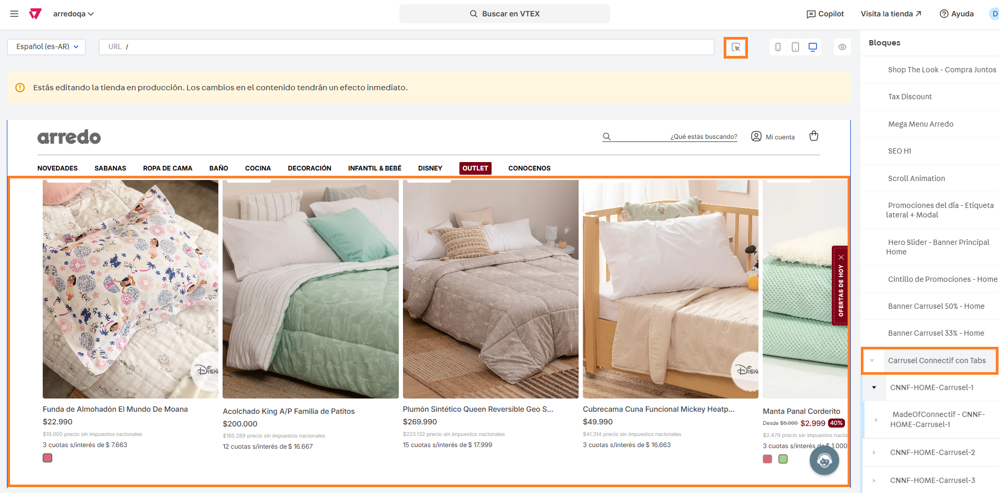
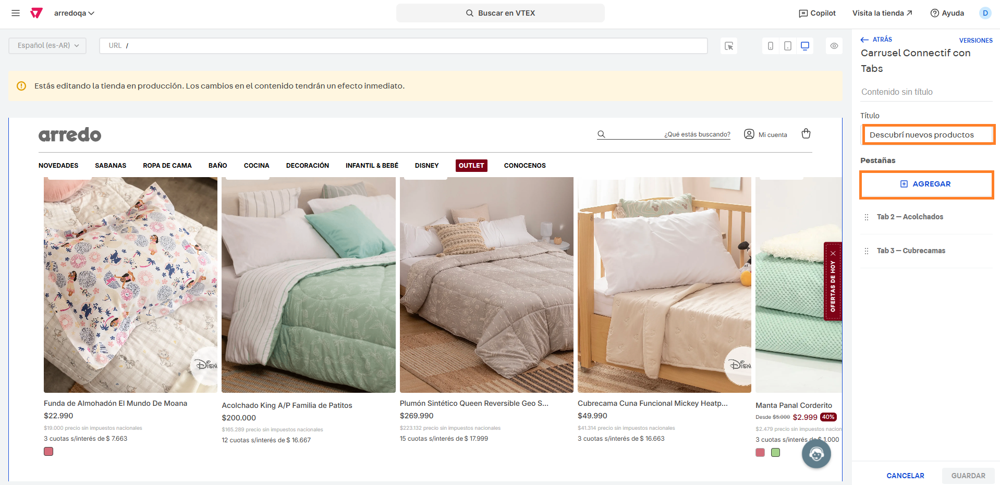

# Carruseles Connectif

## Descripción

Este componente permita mostrar en el sitio un carrusel de Connectif con distintos tabs configurables desde el site editor. Desde el mismo se podrá configurar: Título del carrusel y los nombres y IDs de los tabs.&#x20;

## Pasos para la configuración

1. Ingresar a **Storefront > Site editor.**&#x20;
2.  Utilizar la herramienta del puntero y seleccionar el bloque de carrusel de Connectif, o bien podemos buscar e ingresar al bloque llamado **Carrusel Connectif con Tabs.** 

    <figure><figcaption></figcaption></figure>
3.  Al ingresar al bloque nos encontraremos con el campo **Título** para poder cargar el mismo y las tabs creadas. Desde el botón **+Agregar**, podemos crear más dependiendo cuantas necesitemos: 

    <figure><figcaption></figcaption></figure>
4.  Si ingresamos por alguna de las tabs, nos encontramos con los campos configurados. Recomendamos no modificar esta configuración para no afectar el correcto funcionamiento del carrusel.  

    <figure><figcaption></figcaption></figure>

5. Una vez configuradas las tabs, hacemos click en **Aplicar** para guardar los cambios.&#x20;

