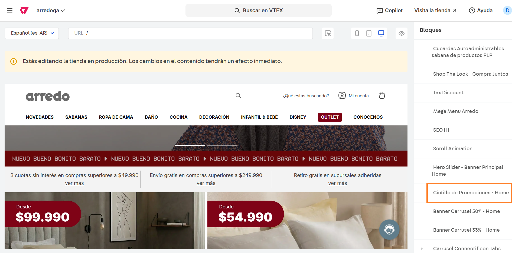
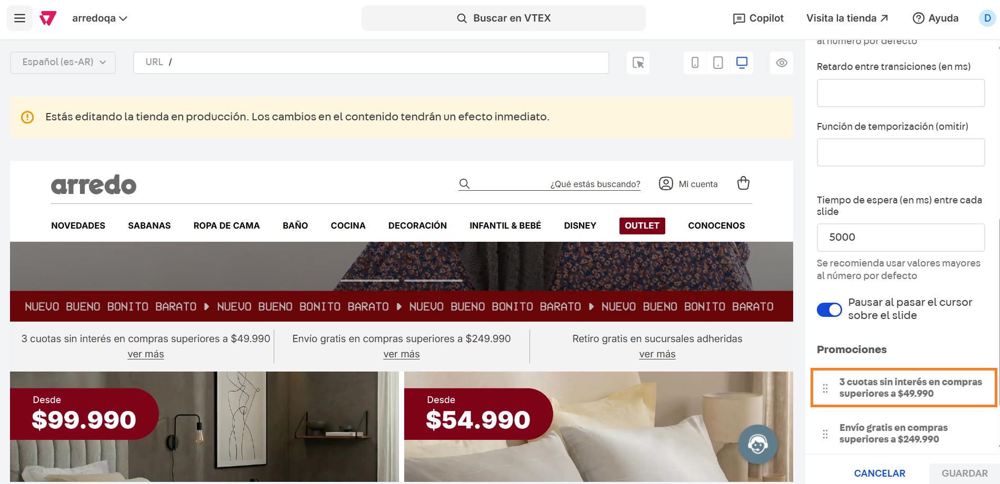

# Cintillo de promociones - Home

## Descripción

Este componente permita cargar hasta tres promociones que se visualizarán en la home con su respectiva URL.&#x20;

## Pasos para la configuración

1. Ingresar a **Storefront > Site editor.**&#x20;
2.  Utilizar la herramienta del puntero y seleccionar el bloque de promociones, o bien podemos buscar e ingresar al bloque llamado **Cintillo de promociones.**  

    <figure><figcaption></figcaption></figure>
3.  Al ingresar al bloque podemos ver las opciones a configurar:

    1. **Mostrar componente:** Se podrá habilitar o deshabilitar la visualización desde esta opción.&#x20;
    2. **Color de fondo:** Desde esta opción se podrá administrar el color de fondo del cintillo.&#x20;
    3. **Color de texto:** Desde esta opción se podrá administrar el color del texto del cintillo.&#x20;
    4. **Activar transición del slide (mobile):** Se podrá habilitar o deshabilitar la transición del slide desde esta opción.&#x20;
    5.  **Velocidad de transición:** Desde esta opción se podrá modificar la velocidad de transición en ms.  

        <figure><figcaption></figcaption></figure>
    6. **Retardo entre transiciones (en ms):** Desde esta opción se podrá modificar el retardo entre transición en ms.
    7. **Tiempo de espera (en ms) entre cada slide:** Desde esta opción se podrá el tiempo de espra entre slides en ms.
    8. **Pausar al pasar el cursor:** Si se activa esta opción, se pausará la transición al pausar el cursor por encima.  

    <figure><figcaption></figcaption></figure>
4.  Para ingresar a editar las promociones, debemos hacer click en algunas de las promociones creadas. Para este caso ingresaremos a la promoción **3 cuotas sin interés.** 

    <figure><figcaption></figcaption></figure>
5. Al ingresar a la promoción, visualizaremos los siguientes campos para configurar:
   1. **Texto principal:** Debe configurarse el texto que se visualizará para esta promoción
   2. **Texto del enlace:** Debe configurarse con el texto que se visualizará en el enlace
   3. **URL de redirección:** Debe configurarse con la URL a la que redirigira el sitio al hacer click en la promoción
   4.  **Abrir enlace en:** Se puede elegir entre "Misma pestaña" o "Nueva pestaña" dependiendo dónde queramos que se abra la redirección.  

       <figure><figcaption></figcaption></figure>

