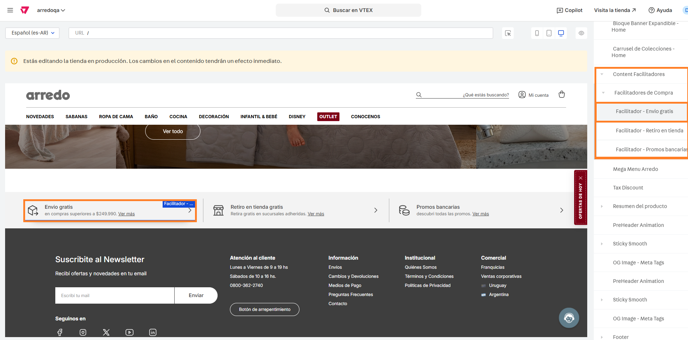

---
metaLinks:
  alternates:
    - >-
      https://app.gitbook.com/s/72B6lE7Nn0jKtcyB10gI/administracion-del-front-del-sitio/uso-del-site-editor/facilitadores
---

# Facilitadores

## Descripción

Desde este bloque podemos agregar información corta pero relevante para el comprador dentro del sitio. Por ejemplo: Envío gratis, Retiro en tienda o Promociones

## Pasos para la configuración

1. Ingresar a **Storefront > Site editor.**&#x20;
2.  Buscar y abrir el bloque llamado **Content Facilitadores** y el llamado **Facilitadores de Compra** e ingresar al facilitador que queramos editar. Para este caso, ingresaremos al primero de **Envío gratis.** 

    <figure><figcaption></figcaption></figure>
3. Al ingresar al bloque, veremos las opciones a configurar:
   1. **Icono:** Desde aquí podemos cargar el icono que se visualizará en dicho facilitador.
   2. **Alt del icono:** Se debe cargar el texto alternativo de la imagen del icono para mejorar la accesibilidad del mismo.&#x20;
   3. **Titulo:** Se debe completar con el texto del título del facilitador
   4. **Subtitulo:** Se debe completar con el texto del subtítulo del facilitador
   5. **Enlace:** En caso que se complete con una URL, al hacer click sobre el facilitador redirigirá a la misma.&#x20;
   6.  **Aria Label del Link:** Se debe completar con el texto descriptivo del link para mejorar la accesibilidad del mismo.  

       <figure><figcaption></figcaption></figure>
4. Una vez completo el facilitador, hacemos click en **Guardar** para que apliquen los cambios.&#x20;

