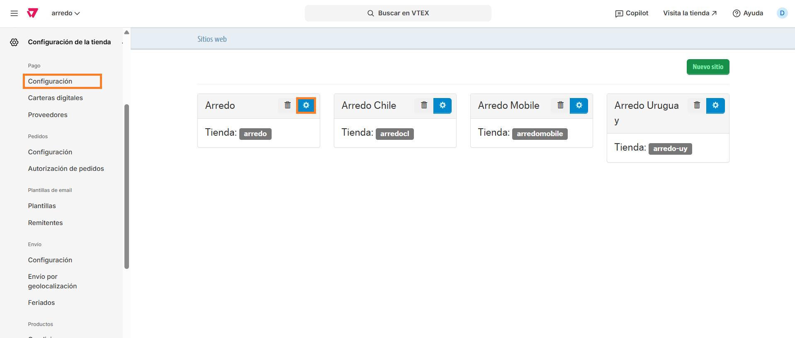
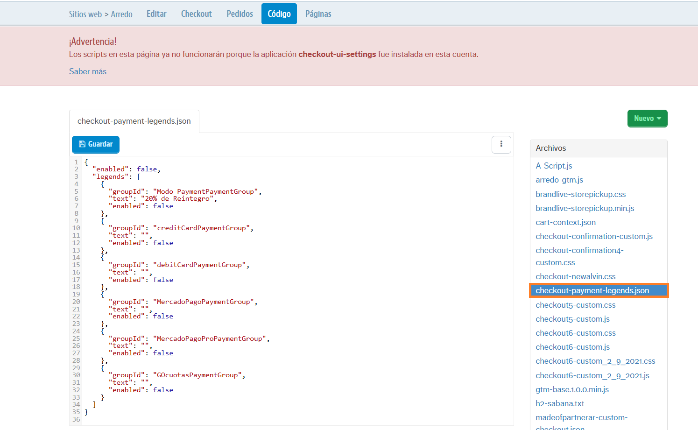
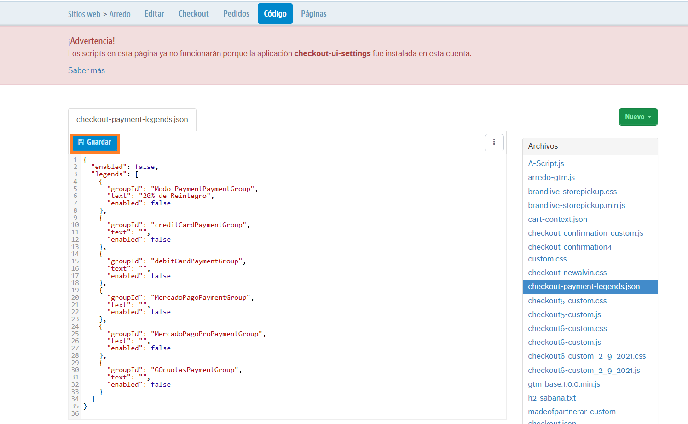

# 📌 Administrar leyendas en métodos de pago del checkout

## Descripción

Este componente permite administrar una leyenda en cada uno de los métodos de pago para poder comunicar descuentos especiales.&#x20;

<figure><figcaption></figcaption></figure>

### Pasos para la configuración

1. Ingresar a **Configuración de la tienda > Arredo** y hacer click en la ruedita.

<figure><figcaption></figcaption></figure>

2.  Al ingresar hacer click en **Código** y en el archivo **checkout-payment-legends.json**<br>

    <figure><figcaption></figcaption></figure>
3. Al ingresar al archivo, vamos a tener disponible las siguientes opciones de configuración:
   1. "enabled": Puede ser true o false. Permite que el componente este encendido o apagado.
   2. "legends": Dentro de este campo se engloban los distintos métodos de pago disponibles en el checkout. \
      El campo "groupId" nos permitirá identificar cuál es el método que estamos modificando. \
      Por ej: MODO: "Modo PaymentPaymentGroup", TARJETA DE CRÉDITO: "creditCardPaymentGroup", TARJETA DE DÉBITO: "debitCardPaymentGroup", MERCADO PAGO: "MercadoPagoProPaymentGroup" y GOCUOTAS: "GOcuotasPaymentGroup"
4. Para modificar la leyenda y su visualización debemos editar los siguientes campos de cada uno:
   1. "text": Debemos completar entre comillas la leyenda que se mostrará debajo del logo. Por ej: "20% de Reintegro".
   2. "enabled": Puede ser true o false. Permite que esa leyenda se muestre o no en el checkout.

```
{
  "enabled": false,
  "legends": [
    {
      "groupId": "Modo PaymentPaymentGroup",
      "text": "20% de Reintegro",
      "enabled": false
    },
    {
      "groupId": "creditCardPaymentGroup",
      "text": "",
      "enabled": false
    },
    {
      "groupId": "debitCardPaymentGroup",
      "text": "",
      "enabled": false
    },
    {
      "groupId": "MercadoPagoProPaymentGroup",
      "text": "",
      "enabled": false
    },
    {
      "groupId": "GOcuotasPaymentGroup",
      "text": "",
      "enabled": false
    }
  ]
}
```

5. Una vez modificado el archivo, se debe hacer click en **Guardar** para aplicar los cambios

<figure><figcaption></figcaption></figure>

