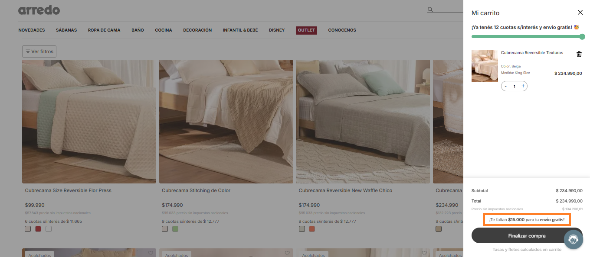
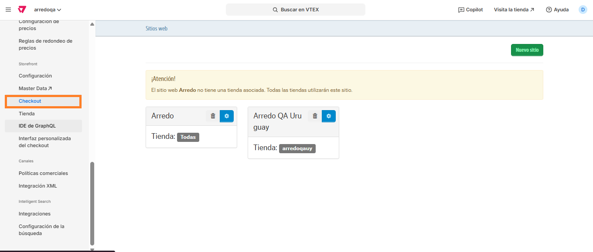
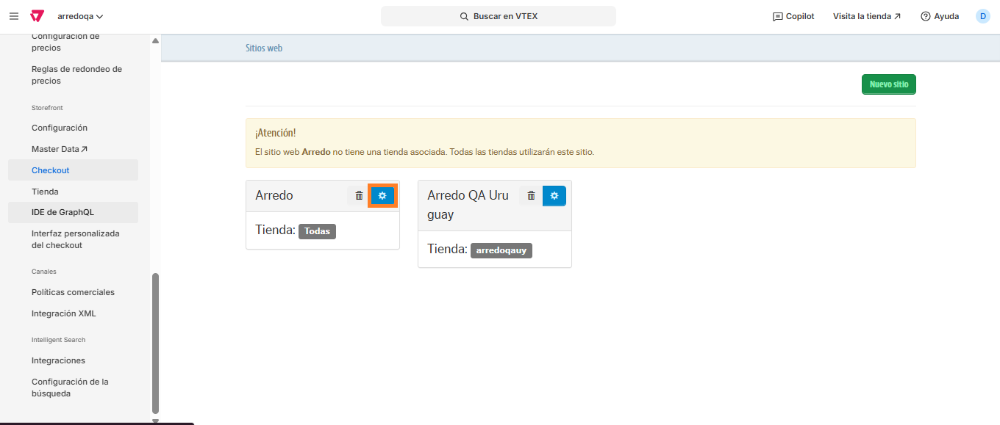
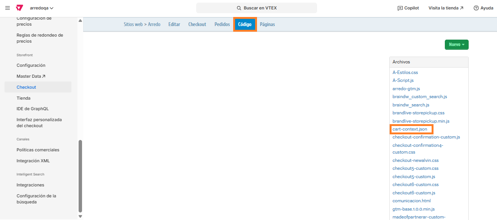
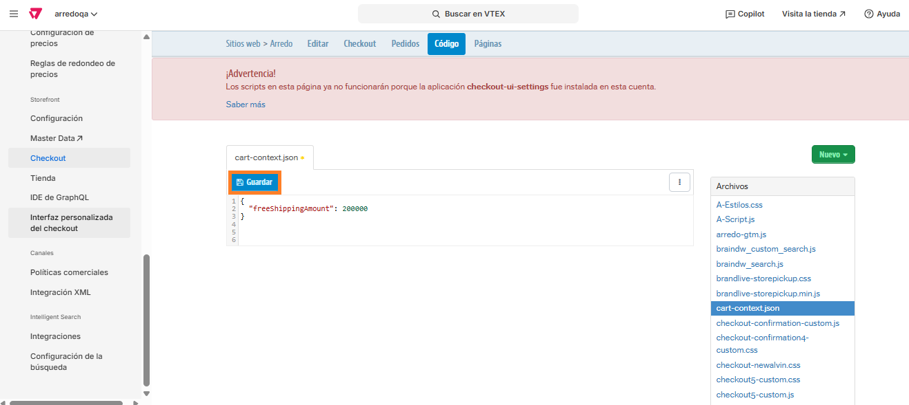
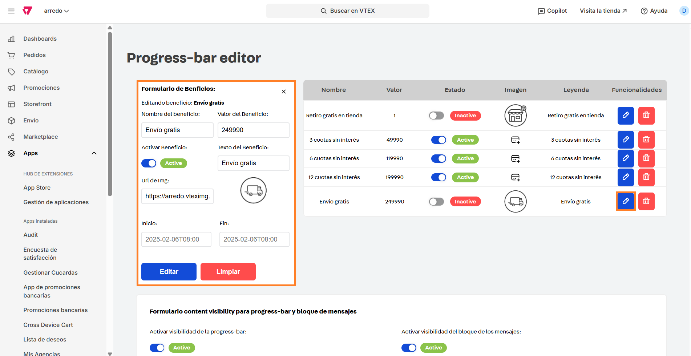

# 📌 Cálculo de envío gratis

## Descripción

Este componente le permite al usuario visualizar cuánto dinero le falta para obtener el envío gratis.

<figure><figcaption></figcaption></figure>

### **Pasos para la configuración** <a href="#pasos-para-la-configuracion" id="pasos-para-la-configuracion"></a>

1. Acceder al administrador de VTEX.
2.  Ingresar por **Configuración de la tienda > Storefront > Checkout.**<br>

    <figure><figcaption></figcaption></figure>
3.  Al ingresar, debemos hacer click en la ruedita ubicada al lado del nombre de la tienda: **Arredo.**<br>

    <figure><figcaption></figcaption></figure>
4.  Una vez allí, nos dirigimos a la pestaña **Código** y hacemos click en el archivo llamado **cart-context.json**<br>

    <figure><figcaption></figcaption></figure>
5.  Al ingresar al archivo nos encontraremos con este pedazo de código: <br>

    <figure><figcaption></figcaption></figure>
6. De dicho código, únicamente debemos editar el valor del campo "freeShippingAmount". Por ejemplo, si quisiéramos que el monto mínimo sea $200.000, deberá quedar así:

```
{
  "freeShippingContext":{
    "props":{
      "minValueForFreeShipping": 200000
    }
  }
}
```

7. Una vez modificado, sólo debemos hacer click en **Guardar**

<figure><figcaption></figcaption></figure>

8. Para que se visualice el beneficio en la barra de beneficios, el ajuste debe realizarse desde la app [Progress bar](https://arredo.myvtex.com/admin/progress-bar), habilitando el beneficio de **Envío Gratis** y modificando el monto mínimo.

<figure><figcaption></figcaption></figure>

