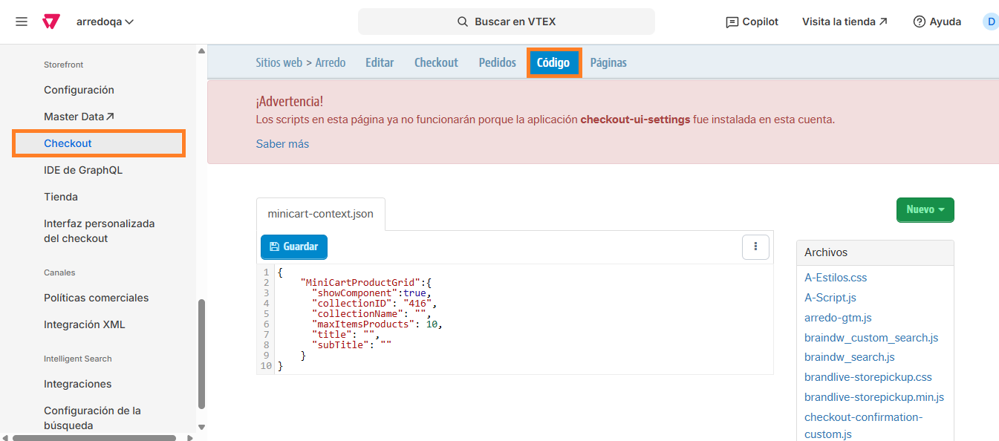
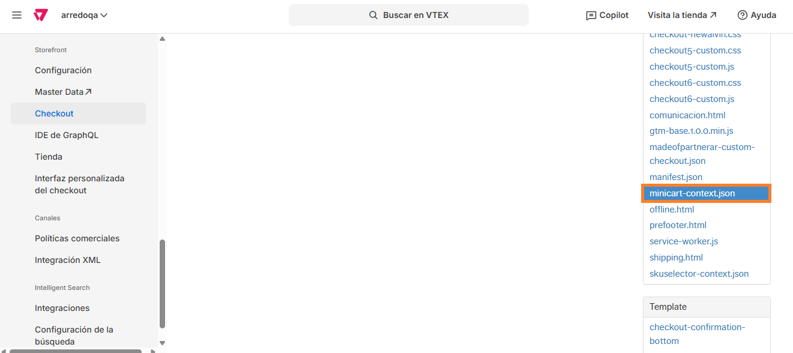
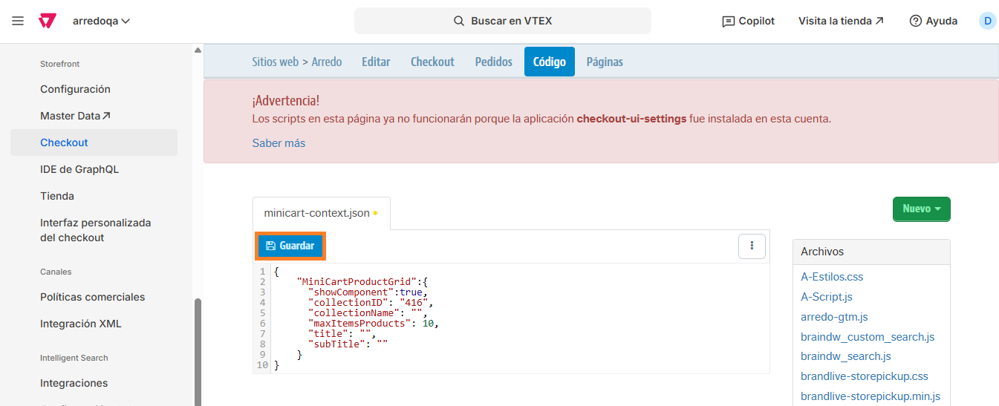

# 📌 Colección de productos en carrito desplegable (vacío)

## Descripción

Este componente permite incentivar la compra mostrando una colección de productos cuando el carrito de compras se encuentra vacío.&#x20;

<figure><figcaption></figcaption></figure>

### Pasos para la configuración

1.  Ingresar por **Configuración de la tienda > Storefront > Checkout > Código.** <br>

    <figure><figcaption></figcaption></figure>
2.  Dentro de los archivos que se muestran a la derecha debemos seleccionar el que se llama **minicart-context.json.** <br>

    <figure><figcaption></figcaption></figure>
3. Al abrir el archivo vamos a poder editar los datos del json destacados con color:
   1. "showCompronent": Puede ser <mark style="color:blue;">true</mark> (para que se muestre la colección) o <mark style="color:$danger;">false</mark>
   2. "collectionID": Se debe completar el ID de la colección entre comillas. Por ej: "<mark style="color:$success;">416</mark>"
   3. "collectionName": Este campo es opcional en caso que se quiera mostrar un título arriba de la colección, se deberá completar entre comillas. Por ej: "<mark style="color:$success;">New in</mark>"
   4. "maxItemsProducts": Se deberá completar con el número máximo de items a mostrar de la colección. Recomendamos que no sean más de 10 productos para no afectar la carga del minicart. Por ej: <mark style="color:$success;">10.</mark>
   5. "title": Se completará entre comillas el nombre que queremos que se muestre como título del carrito. Por ej: "<mark style="color:$success;">Tu carrito está vacio</mark>"
   6. "subTitle": se completará entre comillas el nombre que queremos que se muestre como subtítulo del carrito. Por ej: "<mark style="color:$success;">Llenalo con estos items:</mark>"

```json
{
    "MiniCartProductGrid":{
      "showComponent":true,
      "collectionID": "416",
      "collectionName": "",
      "maxItemsProducts": 10,
      "title": "",
      "subTitle": ""
	}
}
```

4.  Al finalizar los cambios, hacemos click en **Guardar** para que apliquen en el carrito. <br>

    <figure><figcaption></figcaption></figure>



Tener en cuenta que estos cambios pueden demorar algunos minutos en impactar.&#x20;


