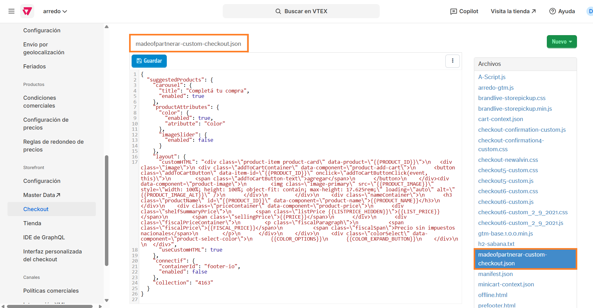
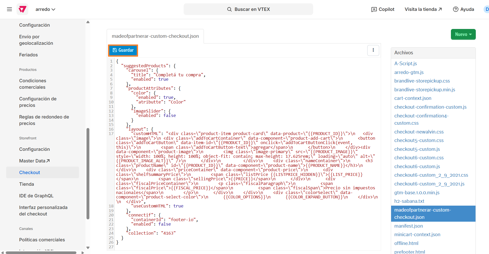

# 📌 Colección de productos recomendados en carrito

## Descripción

Este componente permite incentivar la compra mostrando una colección de productos cuando el cliente ingresa al carrito.&#x20;

<figure><figcaption></figcaption></figure>

### Pasos para la configuración

1.  Ingresar por **Configuración de la tienda > Storefront > Checkout > Código.** <br>

    <figure><figcaption></figcaption></figure>
2.  Dentro de los archivos que se muestran a la derecha debemos seleccionar el que se llama **madeofpartnerar-custom-checkout.json.**<br>

    <figure><figcaption></figcaption></figure>
3. Al abrir el archivo vamos a poder editar los datos del json detallados a continuación:
   1. "title": Se completará entre comillas el nombre que queremos que se muestre como título del carrito. Por ej: "<mark style="color:$success;">Completá tu compra</mark>"
   2. "enabled": Puede ser <mark style="color:blue;">true</mark> (para que se muestre el título de la colección) o <mark style="color:$danger;">false</mark> (Para que no se muestre).&#x20;
   3. "collection": Se debe completar el ID de la colección entre comillas. Por ej: "<mark style="color:$success;">416</mark>"

```json
{
  "suggestedProducts": {
    "carousel": {
      "title": "Completá tu compra",
      "enabled": true
    },
    "productAttributes": {
      "color": {
        "enabled": true,
        "atributte": "Color"
      },
      "imageSlider": {
        "enabled": false
      }
    },
    "layout": {
      "customHTML": "<div class=\"product-item product-card\" data-product=\"{{PRODUCT_ID}}\">\n   <div class=\"image\">\n <div class=\"addToCartContainer\" data-component=\"product-add-cart\">\n      <button class=\"addToCartButton\" data-item-id=\"{{PRODUCT_ID}}\" onclick=\"addToCartButtonClick(event, this)\">\n        <span class=\"addToCartButton-text\">agregar</span>\n      </button>\n    </div><div data-component=\"product-image\">\n        \n      </div>\n         </div>\n    <div class=\"nameContainer\">\n      <h3 class=\"productName\" id=\"{{PRODUCT_ID}}\" data-component=\"product-name\">{{PRODUCT_NAME}}</h3>\n    </div>\n    <div class=\"priceContainer\" data-component=\"product-price\">\n      <div class=\"shelfSummaryPrice\">\n        <span class=\"listPrice {{LISTPRICE_HIDDEN}}\">{{LIST_PRICE}}</span>\n        <span class=\"sellingPrice\">{{PRICE}}</span>\n      </div>\n      <div class=\"fiscalPriceContainer\">\n        <p class=\"fiscalParagraph\">\n          <span class=\"fiscalPrice\">{{FISCAL_PRICE}}</span>\n          <span class=\"fiscalSpan\">Precio sin impuestos nacionales</span>\n        </p>\n      </div>\n    </div>\n    <div class=\"colorSelect\" data-component=\"product-select-color\">\n      {{COLOR_OPTIONS}}\n      {{COLOR_EXPAND_BUTTON}}\n    </div>\n    \n  </div>",
      "useCustomHTML": true
    },
    "connectif": {
      "containerId": "footer-io",
      "enabled": false
    },
    "collection": "4163"
  }
}

```

4.  Al finalizar los cambios, hacemos click en **Guardar** para que apliquen en el carrito. <br>

    <figure><figcaption></figcaption></figure>



Tener en cuenta que estos cambios pueden demorar algunos minutos en impactar.&#x20;

