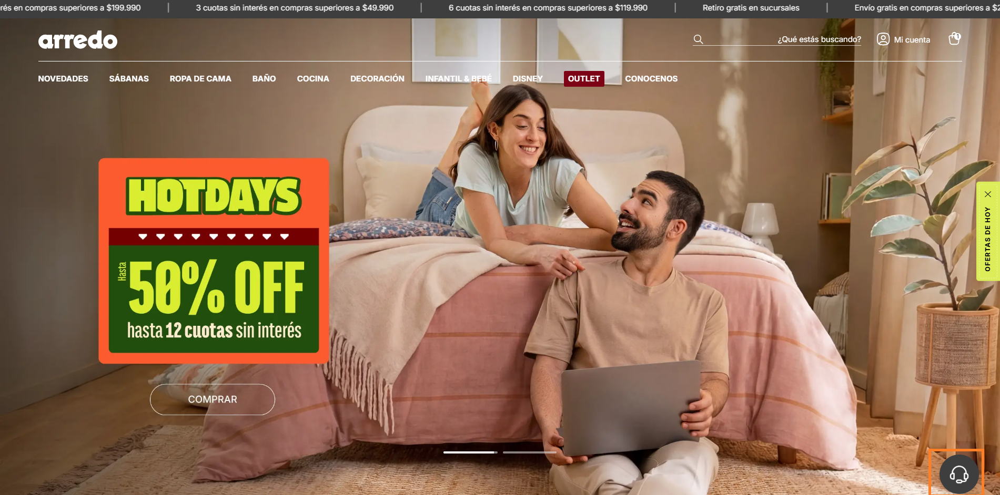
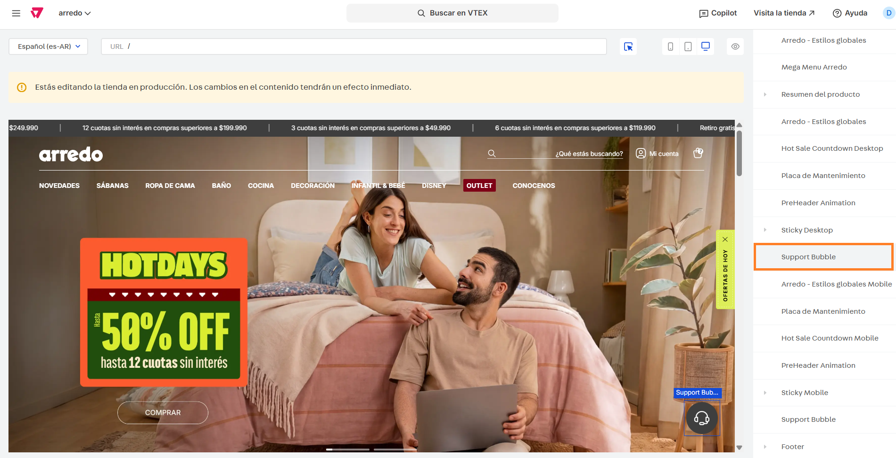
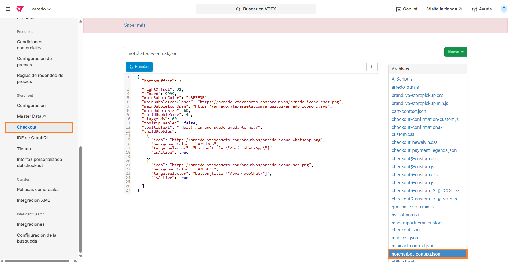

# 📌 Administrar estilos burbuja Notchatbot

## Descripción

Este componente permite administrar desde el site editor los estilos y configuraciones de la burbuja de Notchatbot que se visualiza en home, PLP, PDP, carrito y checkout.

<figure><figcaption></figcaption></figure>

### Pasos para la configuración de HOME, PLP y PDP.

1.  Ingresar a **Storefront > Site editor** e ingresar al bloque llamado **Support Bubble.**<br>

    <figure><figcaption></figcaption></figure>
2. Al ingresar al componente podremos realizar distintas configuraciones para la burbuja:
   1. **Offset inferior (px):** Permite ajustar la distancia desde el borde inferior de la pantalla hasta el botón.
   2. **Offset derecho (px):** Permite ajustar la distancia desde el borde derecho de la pantalla hasta el botón.
   3. **Z-Index:** Permite ajustar la prioridad de superposición entre los elementos (botón y resto de modales del sitio).
   4.  **Color de la burbuja principal:** Permite elegir el color de fondo de la burbuja del chat.<br>

       <figure><figcaption></figcaption></figure>
   5. **Ícono principal (cerrado):** Permite cargar una imagen que servirá como icono del botón al estar cerrada la burbuja.&#x20;
   6. **Ícono principal (abierto):** Permite cargar una imagen que servirá como icono del botón al estar abierta la burbuja.&#x20;
   7. **Tamaño de la burbuja principal (px):** Permite configurar el tamaño de la burbuja declarando el ancho y alto en píxeles (siempre cuadrada).
   8.  **Tamaño de las sub-burbujas (px):** Permite configurar el tamaño de las sub-burbujas declarando el ancho y alto en píxeles (siempre cuadrada).<br>

       <figure><figcaption></figcaption></figure>
   9. **Mostrar tooltip inicial?:** En caso de activar esta opción, se mostrará la leyenda configurada en el siguiente campo al hacer hover (en desktop) o al cargar el sitio (mobile). Para el caso de mobile, en caso que se cierre una vez no volverá a mostrarse.&#x20;
   10. **Texto del tooltip:** Leyenda que se mostrará como mensaje al cliente si la opción anterior se encuentra activa.<br>

       <figure><figcaption></figcaption></figure>
   11. **Sub-burbujas:** Desde el botón +Agregar se podrán configurar las distintas burbujas con su ícono, color y redirección. <br>

       <figure><figcaption></figcaption></figure>

<figure><figcaption></figcaption></figure>

3. Una vez aplicados los cambios hacemos click en **Guardar** para que apliquen. <br>


Estos cambios aplicarán para home, PLP y PDP. Para modificar los estilos de carrito y checkout se debe realizar la configuración a través de un JSON que se detalla a continuación.


### Pasos para la configuración de carrito y checkout

1.  Ingresar por **Configuración de la tienda > Checkout > Código** e ingresar al archivo llamado [notchatbot-context.json](https://arredo.myvtex.com/admin/iframe/portal#/sites/default/code/files/notchatbot-context.json).<br>

    <figure><figcaption></figcaption></figure>
2. Al ingresar al archivo, podemos editar los campos que afectarán al componente de la misma forma que el componente del site editor, con la particularidad de que deben mantener el formato JSON del archivo para que se muestre correctamente.&#x20;

```json
{
    "bottomOffset": 35,                                                                                                        
    "rightOffset": 32,
    "zIndex": 9999,
    "mainBubbleColor": "#3E3E3E",
    "mainBubbleIconClosed": "https://arredo.vtexassets.com/arquivos/arredo-icono-chat.png",
    "mainBubbleIconOpen": "https://arredo.vtexassets.com/arquivos/arredo-icono-x.svg",
    "mainBubbleSize": 60,
    "childBubbleSize": 48,
    "staggerMs": 60,
    "tooltipEnabled": false,
    "tooltipText": "¡Hola! ¿En qué puedo ayudarte hoy?",
    "childBubbles": [
      {
        "icon": "https://arredo.vtexassets.com/arquivos/arredo-icono-whatsapp.png",
        "backgroundColor": "#25d366",
        "targetSelector": "button[title=\"Abrir WhatsApp\"]",
        "isActive": true
      },
      {
        "icon": "https://arredo.vtexassets.com/arquivos/arredo-icono-ncb.png",
        "backgroundColor": "#3E3E3E",
        "targetSelector": "button[title=\"Abrir WebChat\"]",
        "isActive": true
      }
    ]
  }
```

Para eso es necesario que:

* los números se ingresen sin comillas.
* valores de tipo texto se ingresen con comillas ("").
* valores de tipo true o false se ingrese directamente el texto.&#x20;

#### Equivalencias con los nombres del site editor

* bottomOffset = **Offset inferior (px)**
* rightOffset = **Offset derecho (px)**
* zIndex = **Z-Index**
* mainBubbleColor = **Color de la burbuja principal**
* mainBubbleIconClosed = **Ícono principal (cerrado)**&#x20;
* mainBubbleIconOpen = **Ícono principal (abierto)**
* mainBubbleSize = **Tamaño de la burbuja principal (px)**
* childBubbleSize = **Tamaño de las sub-burbujas (px)**
* staggerMs = **Milisegundos de animacion al abrir, no es necesario cambiar.**
* tooltipEnabled = **Mostrar tooltip inicial**
* tooltipText = **Texto del tooltip**
* childBubbles = C**ontenedor de las sub-burbujas, no modificar.**
* icon = I**cono de la subburbuja**&#x20;
* backgroundColor = C**olor de fondo de la subburbuja**
* targetSelector = **A qué botón de Notchatbot se vincula, esto no se debe modificar**
* isActive = **Activa**
