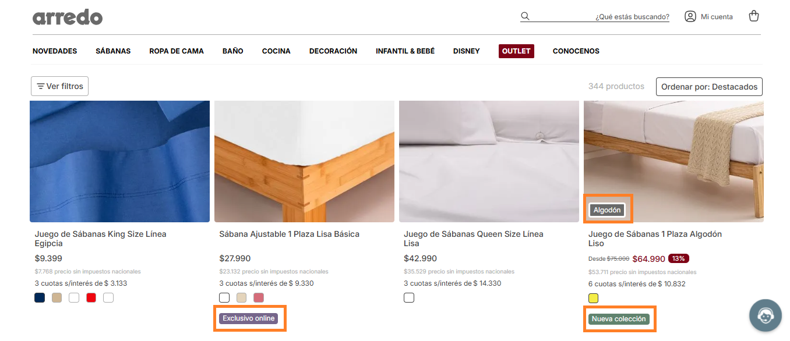
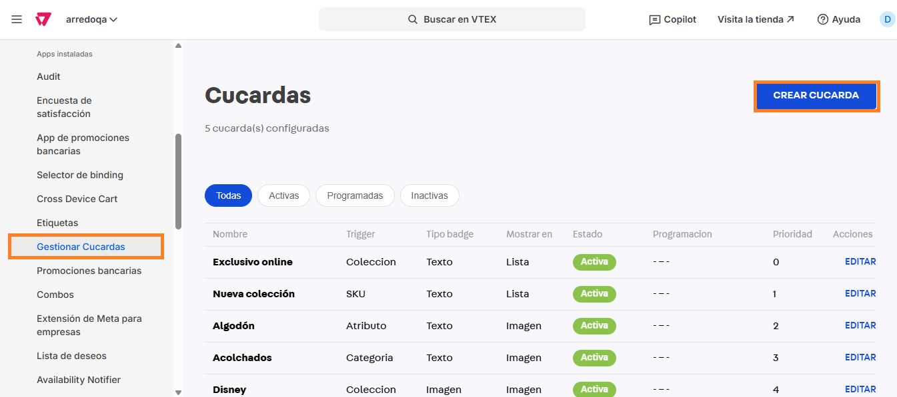
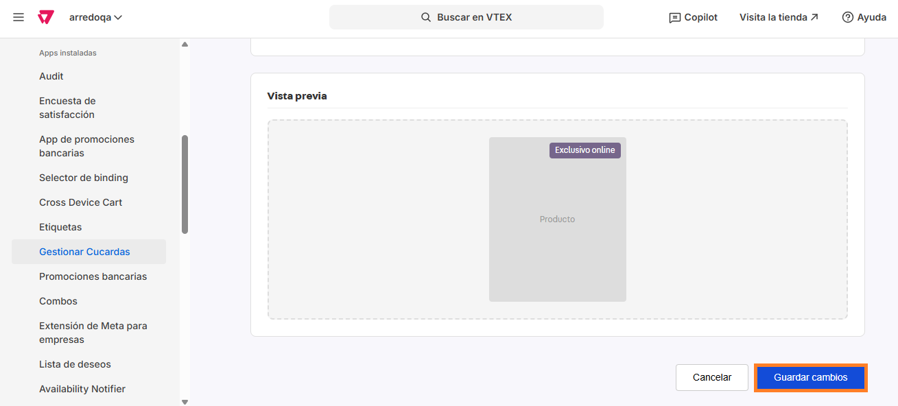
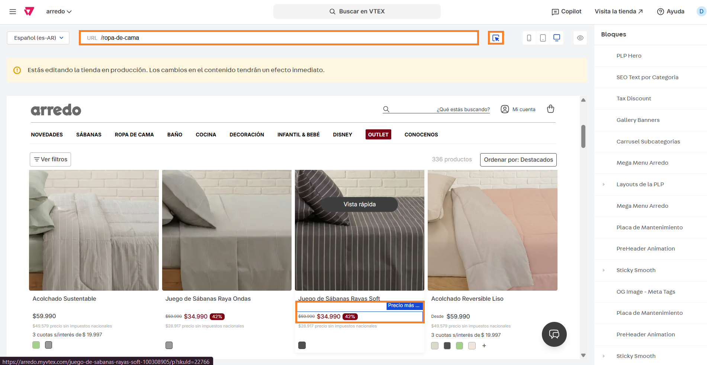

# 📌 App de cucardas autoadministrable

## Descripción

Esta aplicación nos permite crear cucardas para todo el sitio, pudiendo administrar su estado, programación, prioridad, posición y estilos entre otras opciones.&#x20;

<figure><figcaption></figcaption></figure>

## Pasos para la configuración

1. Ingresar a **Apps> Apps instaladas > Gestionar cucardas.** &#x20;
2. Al ingresar a la aplicación, veremos las cucardas que ya se encuentran configuradas en el sitio con alguna información importante a la vista, opción para editar o eliminar y la opción para **Crear cucarda**. Para este caso, ingresamos por esta última opción a ver las configuraciones:

<figure><figcaption></figcaption></figure>

3. Al ingresar a crear una nueva cucarda veremos la información a completar separada por secciones:
   1. **General**
      1. **Nombre:** Se debe completar con el nombre que identifica a la cucarda en la aplicación. No es necesario que sea el mismo texto que se muestre en la misma pero es una buena práctica hacerlo de esa forma para una fácil identificación.&#x20;
      2. **Prioridad:** Se debe establecer una prioridad para la cucarda en caso que dos cucardas coincidan en posición para que una se muestre por encima de la otra. Se completan con números siendo 0 la prioridad máxima.&#x20;
      3.  **Activa:** Desde este selector se puede activar o desactivar fácilmente.  

          <figure><figcaption></figcaption></figure>
   2. **Programación (opcional):** En caso de querer programar el encendido y apagado de la cucarda se debe configurar la fecha de inicio y fin y la hora en los siguientes campos:
      1. Fecha inicio
      2.  Fecha fin 

          <figure><figcaption></figcaption></figure>
   3. **Trigger (condición de activación):** Desde aquí se configurará cuál será el criterio que se tomará en cuenta para mostrarse o no en un producto. Los mismos pueden ser:
      1.  **Colección:** En caso de optar por esta opción se desplegará un campo para completar el o los IDs de colección donde se mostrará esta cucarda. Debe completarse uno por linea.  

          <figure><figcaption></figcaption></figure>
      2.  **Categoría:** En caso de optar por esta opción se desplegará un campo para completar con las URLs donde se mostrará esta cucarda. Debe completarse uno por linea.  

          <figure><figcaption></figcaption></figure>
      3.  **Marca:** En caso de optar por esta opción se desplegará un campo para completar con las marcas donde se mostrará esta cucarda. La misma debe estar asignada a los productos desde el administrador de catálogo. Debe completarse uno por linea.  

          <figure><figcaption></figcaption></figure>
      4.  **Atributo:** En caso de optar por esta opción se desplegarán dos campos para el nombre del atributo (tal cual esté creada desde el árbol de categorías) y el valor del atributo seleccionado (tal cual esté creado desde el árbol de categorías). Este valor se debe asignar a cada producto desde la configuración del producto.  

          <figure><figcaption></figcaption></figure>
      5.  **SKU:** En caso de optar por esta opción se desplegará un campo para completar el o los SKUs donde se mostrará esta cucarda. Debe completarse uno por linea.  

          <figure><figcaption></figcaption></figure>
      6. **Descuentos:** En caso de optar por esta opción, sólo nos permitirá mostrar o no la leyenda.&#x20;
      7.

          <figure><figcaption></figcaption></figure>
      8.  **Últimas unidades:** En caso de optar por esta opción, será necesario configurar el umbral de unidades mínimas para que comience a mostrarse. 

          <figure><figcaption></figcaption></figure>
      9. **Stock en sucursal: Si se elegi esta opción, la cucarda se mostrará dependiendo la configuración de los campos:**
         1. **Warehouse ID (debe tener stock):** Es el depósito para el que se activará la cucarda.&#x20;
         2. **Stock minimo:** A partir de cuantas unidades se mostrará la cucarda.
         3.  **Warehouse ID a excluir (opcional — debe tener stock = 0):** Si se completa, la cucarda solo aparece si ESTE warehouse NO tiene stock. Ej: cucarda "Retiro en MDVB" activa cuando MDVFC tiene stock pero inv\_uy no. 

             <figure><figcaption></figcaption></figure>
   4.  **Apariencia del badge:** Desde aquí podemos administrar la apariencia de la cucarda. Tener en cuenta que la configuración se puede hacer de forma Global, como también sumar una configuración especial para mobile o PDP (Para esto, se debe activar la opción **Activar overide**) 

       <figure><figcaption></figcaption></figure>

       <figure><figcaption></figcaption></figure>

       1. **Tipo de badge:** Se puede elegir entre Imagen, Texto, Icono + Texto o Porcentaje. Dependiendo del tipo seleccionado, se desplegaran otros campos:
          1.  **Imagen:** Se desplegarán campos adicionales para completar las URLs de la imagen para desktop y mobile y el ancho de la imagen para cada resolución.  

              <figure><figcaption></figcaption></figure>
          2. **Texto:** Se desplegarán campos adicionales para configurar la apariencia del texto y la cucarda.&#x20;
             1. **Texto del badge:** Se debe completar con el texto que se visualizará en la cucarda.&#x20;
             2. **Color del texto:** Se debe seleccionar el color en el que se visualizará el texto dentro de la cucarda.&#x20;
             3. Color de fondo: Se debe seleccionar el color de fondo de la cucarda.&#x20;
             4. Color del borde: Se debe seleccionar el color del borde de la cucarda.&#x20;
             5. Ancho del borde: Se debe completar la medida en px del ancho del borde de la cucarda.&#x20;
             6. Border radius: Se debe completar la medida en px del radio de borde de la cucarda (para hacerla más o menos redondeada).&#x20;
             7. Tamaño de fuente: Se debe completar con el tamaño tipográfico en px.&#x20;
             8.  Peso de fuente: Podemos elegir el peso tipográfico entre Normal (400), SemiBold (600) o Bold (700).  

                 <figure><figcaption></figcaption></figure>
          3. **Posición y visibilidad:** Desde esta sección podemos elegir la posición relativa sobre la imagen y su visibilidad en imagen o lista.
             1.  **Posición del badge:** Esta posición aplica únicamente en caso que la cucarda se muestre sobre la imagen. Se puede ubicar arriba o abajo a la izquierda, derecha o centro o también ocupando la franja completa de la card. 

                 <figure><figcaption></figcaption></figure>
             2.  **Mostrar en:** Se podrá elegir mostrar sólo en la imagen, sólo en la lista bajo el producto o en ambos.  

                 <figure><figcaption></figcaption></figure>

          4.  **Device y destacado:** Desde esta sección se puede seleccionar que se muestre en desktop y/o mobile y PLP.  

              <figure><figcaption></figcaption></figure>
          5.  **Vista previa:** Desde este módulo podemos obtener una vista previa de cómo se mostrará nuestra cucarda para desktop y mobile, en PDP y PLP.  

              <figure><figcaption></figcaption></figure>
4.  Una vez completados todos los pasos, hacemos click en **Guardar cambios** para guardar la configuración.  

    <figure><figcaption></figcaption></figure>

### ¿Cómo ocultar porcentaje de descuento por producto?

1. Ingresar a **Storefront > Site editor.**&#x20;
2.  Ingresar a una PLP de productos y con el puntero, seleccionar la cucarda de descuento en algún producto que lo tenga. 

    <figure><figcaption></figcaption></figure>
3. Al hacer click en el bloque, se abrirán las opciones a configurar:
   1. Mostrar Desde?: En caso de deshabilitarlo, no se mostrará la leyenda "desde" en ningún producto.&#x20;
   2. Mostrar badge de descuento?: En caso de deshabilitarlo, no se mostrará la cucarda de descuento en ningún producto.&#x20;
   3.  Ocultar descuento en estos IDs: En este campo podemos cargar los IDs de los productos a los que queramos deshabilitar la cucarda de descuento. Se deben cargar separados por coma (,). 

       <figure><figcaption></figcaption></figure>
4. Una vez configurado el bloque, podemos hacer click en **Guardar** para que apliquen los cambios.&#x20;
