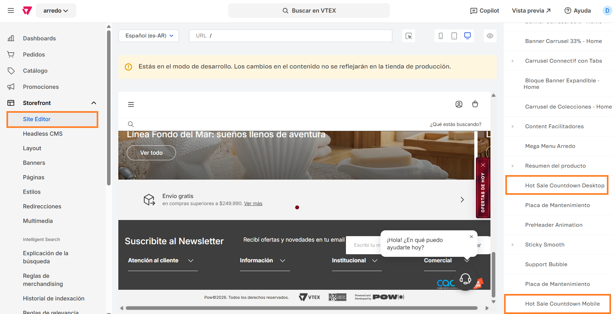

# 📌 Contador en home y landing transaccional

## Descripción

Este componente permite configurar una fecha inicio y fin y mostrar una cuenta regresiva por encima del header. El mismo se apaga una vez finalizada la cuenta regresiva.&#x20;

También es posible administrar los estilos del contador (colores de fondo, textos y CTA).&#x20;

<figure><figcaption></figcaption></figure>

### Pasos para la configuración

1.  Ingresar a **Storefront > Site editor** e ingresar al bloque llamado **Hot Sale Countdown** (Desktop o Mobile, se deben configurar para ambas resoluciones).  

    <figure><figcaption></figcaption></figure>
2. Al ingresar al bloque podemos configurar las siguientes opciones:
   1. **Mostrar contador?:** Si esta opción está activa, el contador se mostrará a partir de las fecha configuradas.&#x20;
   2. **Fecha y hora de inicio:** Se debe configurar la fecha y hora de inicio del contador. El contador se mostrará A PARTIR de esta fecha y hora exacta.
   3. **Fecha y hora de fin:** Se debe configurar la fecha y hora de fin del contador. El contador se mostrará A PARTIR de esta fecha y hora exacta.
   4.  **Mostrar dias, horas, minutos, segundos:** Dependiendo las opciones activas, se mostrarán en el contador.  

       <figure><figcaption></figcaption></figure>
   5. **Color de fondo:** Permite configurar el color de fondo del bloque contador.&#x20;
   6. **Color de texto:**  Permite configurar el color de los textos del bloque contador.&#x20;
   7. **Anuncio (texto destacado):** Permite configurar un título al contador.
   8. **Anuncio (texto regular):** Permite configurar un subtítulo al contador.
   9. **Texto del CTA:** Permite configurar un CTA dentro al contador.
   10. **URL del CTA:** Se puede configurar una URL para que redirija desde el CTA.  

       <figure><figcaption></figcaption></figure>
   11. **Etiqueta días:** Se puede configurar una leyenda para los días.&#x20;
   12. **Etiqueta horas:** Se puede configurar una leyenda para los horas.&#x20;
   13. **Etiqueta minutos:** Se puede configurar una leyenda para los minutos.&#x20;
   14. **Etiqueta segundos:** Se puede configurar una leyenda para los segundos.&#x20;
   15. **Mostrar sólo en estas URLs:** Se pueden configurar URLs donde se mostrará el contador con estas opciones.  

       <figure><figcaption></figcaption></figure>
