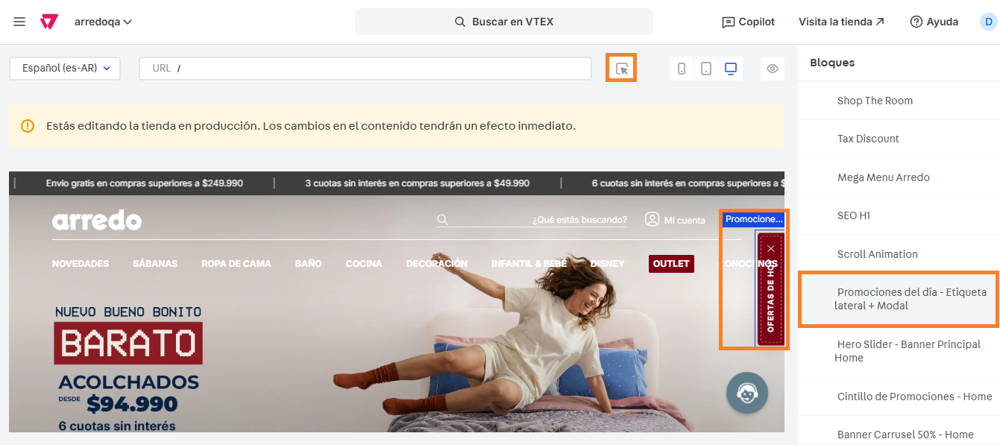

# 📌 Ofertas de hoy

## Descripción 

Este componente permite mostrar promociones en la home mediante un modal desplegable que permite redirigir a los usuarios a una sábana de productos o link del sitio, pudiendo mostrar un cupón de descuento y otra información relevante.&#x20;

<figure><figcaption></figcaption></figure>

### Pasos para la configuración

1. Ingresar a **Storefront > Site editor.**&#x20;
2. Para ingresar al bloque, debemos seleccionar el bloque con el puntero o bien, buscar el bloque llamado **Promociones del día - Etiqueta lateral + Modal** y hacerle click.

<figure><figcaption></figcaption></figure>

3. Al ingresar al bloque, podemos modificar las configuraciones generales del bloque:
   1. **Encender/apagar componente:** Permite encender o apagar el componente.&#x20;
   2. **Mostrar etiqueta:** Permite encender o apagar la etiqueta lateral.&#x20;
   3. **Texto de la etiqueta:** Se debe completar con el texto que se visualizará en la etiqueta de la home.&#x20;
   4.  **Color de fondo:** Se debe completar con el color de fondo que se visualizará la etiqueta. 

       <figure><figcaption></figcaption></figure>
   5. **Imagen de fondo:** Se puede completar con una imagen de fondo que se visualizará la etiqueta. En caso de configurarla, pisará la configuración de color de fondo.&#x20;
   6. **Color de texto:** Se debe completar con el color del texto que se visualizará la etiqueta.
   7.  **Título del modal:** Se debe completar con el título que se visualizará al abrir el modal. 

       <figure><figcaption></figcaption></figure>
   8.  **Categorías:** Desde esta sección podremos cargar hasta 4 categorías que funcionarán como filtro dentro del modal. Si ingresamos a editar alguna de ellas podemos ver las configuraciones a realizar:

       <figure><figcaption></figcaption></figure>

       1. **Identificador:** Identificador de la categoría para el site editor.&#x20;
       2. **Nombre de la categoría:** Nombre que se visualizará en el filtro del modal
       3.  **Promociones:** Visualizaremos hasta 3 promociones que podemos editar al ingresar 

           <figure><figcaption></figcaption></figure>

           1. **Mostrar promoción?:** Permite mostrar o no la promoción configurada.&#x20;
           2. **Fecha de inicio:** Se debe completar con la fecha de inicio de la promoción.&#x20;
           3. **Fecha de fin:** Se debe completar con la fecha de fin de la promoción.&#x20;
           4. **Mostrar banner?:** Permite mostrar o no el banner en la promoción configurada.&#x20;
           5.  **Imagen:** Permite cargar una imagen que acompañe a la promoción configurada.  

               <figure><figcaption></figcaption></figure>
           6. **Texto alternativo:** Se debe completar con el texto alternativo de la imagen para mejorar su accesibilidad.&#x20;
           7. **Título:** Se debe completar con el título de la promoción.&#x20;
           8. **Subtítulo:** Se debe completar con el subtítulo de la promoción.&#x20;
           9. **Mostrar botón?:** Permite mostrar el CTA dentro de la promoción.&#x20;
           10. **Texto del botón:** Se debe configurar con el texto que se visualizará en el CTA de la promoción.&#x20;
           11. **URL destino:** Se debe configurar con la URL a la que redirigirá el CTA de la promoción.  

               <figure><figcaption></figcaption></figure>
           12. **Mostrar legales?:** Permite mostrar una leyenda con las bases de la promoción.&#x20;
           13. **Texto:** Se debe configurar con el texto del link de los legales.&#x20;
           14. **URL legales:** Se debe configurar con la URL de los legales.&#x20;
           15. **Mostrar cupón?:** Permite mostrar una leyenda con un cupón de descuento. &#x20;
           16. **Código del cupón:** Se debe completar con el código del cupón de la promoción.  

               <figure><figcaption></figcaption></figure>
           17. **Mostrar link promo bancaria:** Permite mostrar una leyenda para redirigir al usuario a las promociones bancarias.&#x20;
           18. **Texto del link:** Se debe configurar con el texto del link de las promociones bancarias.&#x20;
           19. **URL destino:** Se debe configurar con la URL de las promociones bancarias.  

               <figure><figcaption></figcaption></figure>

           i. Una vez configurada la promoción, se debe hacer click en **Aplicar** para guardar esos cambios. Repetir el proceso para cada promoción y hacer click en **Guardar** para aplicar los cambios en el sitio.&#x20;
