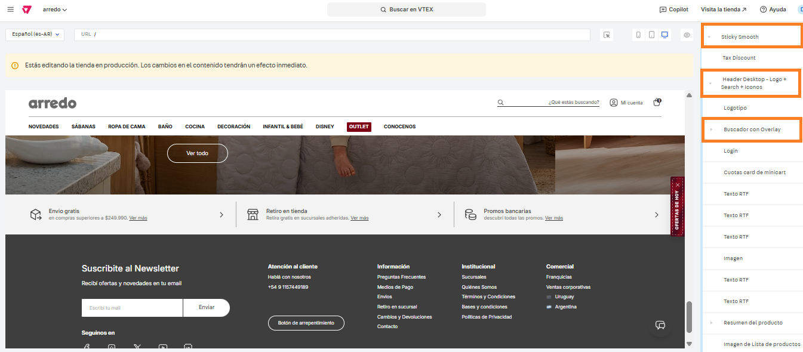

# 📌 Productos sugeridos en buscador

## Descripción 

Este componente permite mostrar dentro del buscador de productos una colección de productos sugeridos por Arredo. También se podrán configurar las categorías más buscadas. Toda esta información es configurable desde el site editor.&#x20;

<figure><figcaption></figcaption></figure>

## Pasos para la configuración

1. Ingresar a **Storefront > Site editor.**&#x20;
2.  Para ingresar al bloque, debemos buscar el bloque llamado **Sticky Smooth** y abrirlo y otro bloque llamado **Header - Logo + Search + Iconos** y abrirlo también. Dentro de ese bloque encontremos otro llamado **Buscador con Overlay**, le hacemos click para ingresar. &#x20;

    <figure><figcaption></figcaption></figure>
3.  Al ingresar al bloque, debajo del título **"Lo más buscado"** podremos hacer click en alguno de los items para editar su nombre y URL.  

    <figure><figcaption></figcaption></figure>

    <figure><figcaption></figcaption></figure>
4.  Si seguimos scrolleando, vamos a poder editar el título de la colección que se visualiza en el buscador y el ID de la colección asociada: 

    <figure><figcaption></figcaption></figure>

5. Una vez que completamos toda la información, hacemos click en **Guardar** para que apliquen los cambios.&#x20;


Tener en cuenta que el bloque debe editarse tanto en desktop como para mobile y por eso notarán que el bloque Sticky Smooth se encuentra dos veces (el primero es desktop y el segundo mobile).

