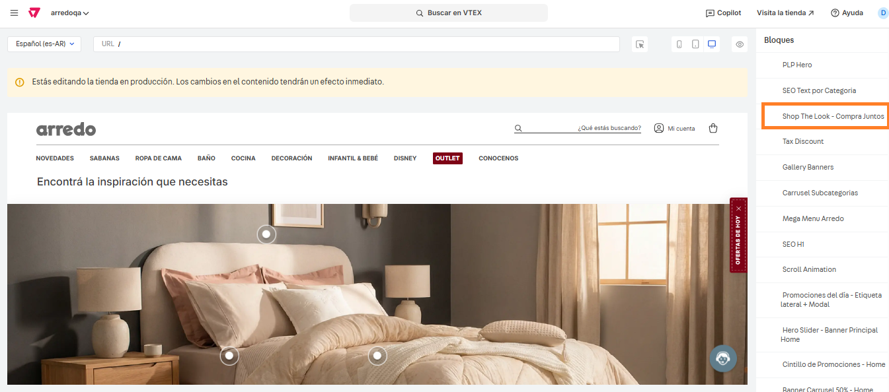

# 📌 Shop the room

## Descripción 

Este componente permite mostrar en la home una habitación con varios productos que el cliente puede agregar de forma individual al carrito o bien, agregar el look completo.  

<figure><figcaption></figcaption></figure>

## Pasos para la configuración

1. Ingresar a **Storefront > Site editor.**&#x20;
2.  Para ingresar al bloque, debemos buscar el bloque llamado **Shop the Room - Compra juntos** y seleccionarlo.  

    <figure><figcaption></figcaption></figure>
3. Al ingresar al bloque podemos ver las configuraciones del componente:
   1. **Mostrar componente?:** Desde esta opción podemos administrar el encendido y apagado del componente.&#x20;
   2. **Titulo de la sección:** Se deberá completar con el título que se mostrará antes del componente.&#x20;
   3.  **URL del banner (desktop y mobile):** Desde aquí se podrán cargar las imagenes para desktop y mobile de la habitación.  

       <figure><figcaption></figcaption></figure>
   4. **Texto alternativo del banner:** Aquí se debe cargar el texto alternativo de las imágenes para mejorar la accesibilidad de las mismas.&#x20;
   5. **Texto del botón:** Debemos completar con el texto que se verá en el botón que permite agregar los productos al carrito.&#x20;
   6.  **Productos (bullets):** Desde el botón **+Agregar** se podrán agregar la cantidad de bullets que necesitemos agregar a la imagen y administrar su posición.  

       <figure><figcaption></figcaption></figure>

       Para este ejemplo ingresaremos a uno creado para ver las opciones:

       1. **SKU ID del producto:** Se debe completar con el SKU ID del producto que queramos configurar.&#x20;
       2. **Posición X (%):** Se debe completar en porcentaje la posición del bullet sobre el eje X (horizontal).&#x20;
       3. **Posición Y (%):** Se debe completar en porcentaje la posición del bullet sobre el eje Y (vertical).&#x20;
       4. **Posición X Mobile (%):** Se debe completar en porcentaje la posición del bullet sobre el eje X  para mobile (horizontal).&#x20;
       5.  **Posición Y Mobile (%):** Se debe completar en porcentaje la posición del bullet sobre el eje Y para mobile (vertical).  

           <figure><figcaption></figcaption></figure>
   7. Una vez aplicados los cambios del bullet, hacemos click en **Aplicar** para que se guarden y repetimos el proceso por cada bullet que sea necesario configurar.&#x20;
