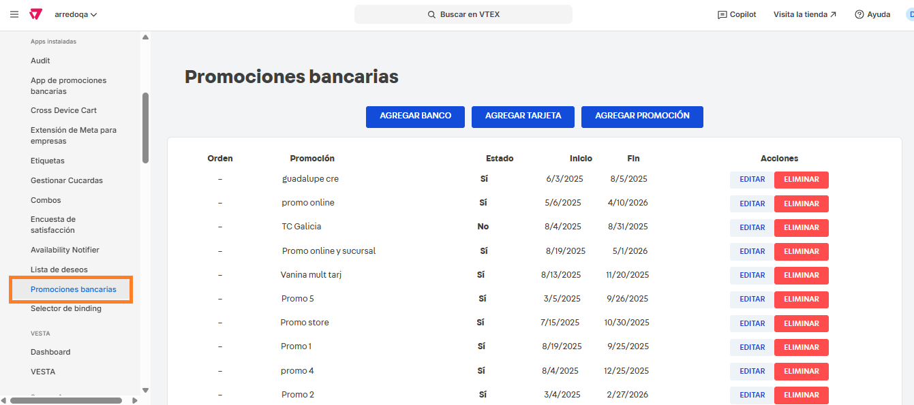
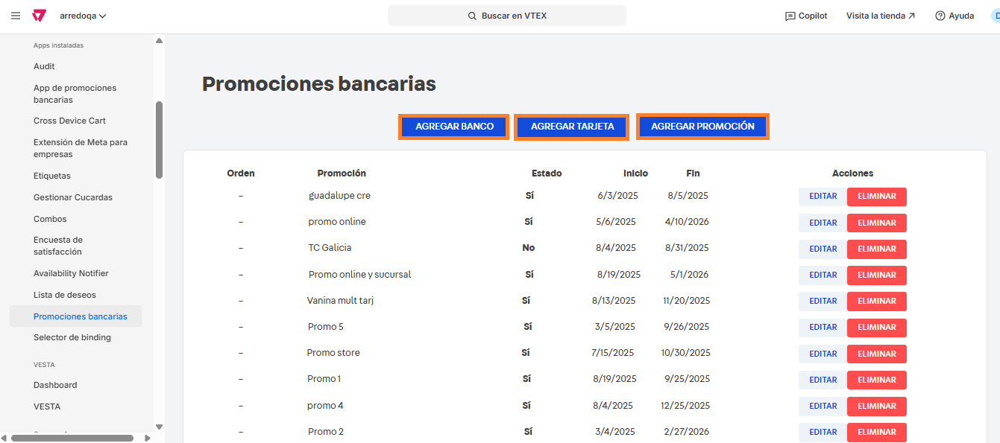
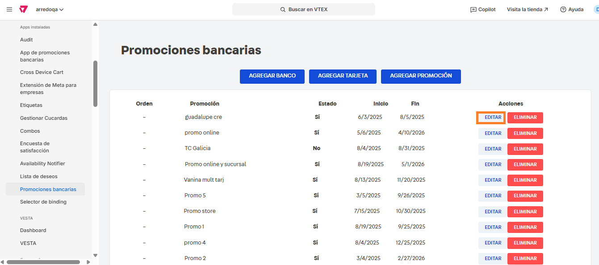
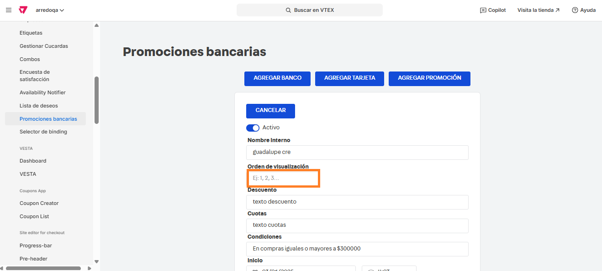
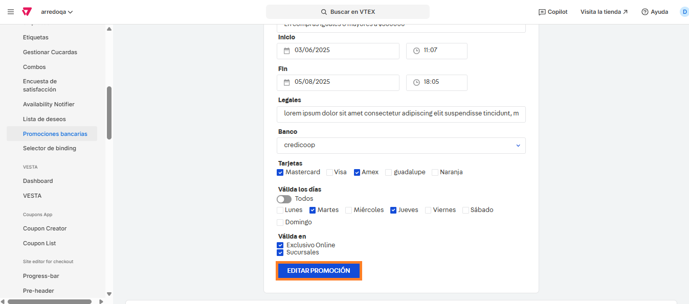

# 📌 Landing de promociones bancarias

## Descripción

Esta landing custom nos permite comunicar de forma eficiente las promociones bancarias vigente, pudiendo configurarle una fecha de inicio y fin, su estado y su prioridad en los casos donde coincidan y días y vigencia para poder administrar su posición desde una app.&#x20;

### Pasos para la configuración

1.  Ingresar al administrador de **VTEX > Apps > Apps instaladas > Promociones bancarias.**  

    <figure><figcaption></figcaption></figure>
2.  Al ingresar a la app, vamos a poder agregar bancos, tarjetas o nuevas promociones desde las opciones señaladas.  

    <figure><figcaption></figcaption></figure>
3.  Para editar una promoción, hacemos click en **Editar** en alguna de las promociones creadas. 

    <figure><figcaption></figcaption></figure>
4.  Al hacer click en **Agregar promoción** o **Editar**, podremos modificar todos los campos de la promoción, así como también asignarle un orden de visualización, asignándole un número siendo el 1 el valor más alto (por lo que se visualizará primero).  

    <figure><figcaption></figcaption></figure>
5. Una vez editados los valores, hacemos click en **Editar promoción** para que apliquen los cambios.&#x20;

<figure><figcaption></figcaption></figure>
