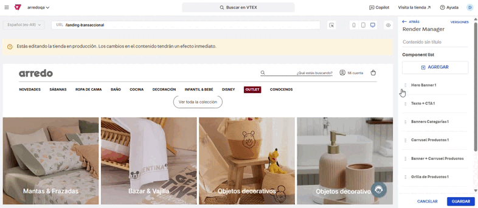

# 📌 Landing transaccional

## Descripción

Esta landing custom nos permite comunicar de forma eficiente los productos del sitio especialmente para nuevos lanzamientos o eventos, pudiendo administrar el encendido y apagado de distintos componentes y su posición dentro de la landing.&#x20;

El template de esta landing se puede reutilizar para crear nuevas páginas seleccionándolo desde el administrador.

<figure><figcaption></figcaption></figure>

### Pasos para la configuración

1. Ingresar a **Storefront > Site editor.**&#x20;
2. Para ingresar a la landing, nos dirigimos a la URL a la que le hayamos asignado el template **#landing-transaccional.** Para este caso, usaremos la URL **/landing-transaccional.**&#x20;

<figure><figcaption></figcaption></figure>

3.  Al ingresar a la landing, vamos a buscar el bloque llamado **Landing Transaccional - Render** y abrirlos para mostrar todos los bloques 

    <figure><figcaption></figcaption></figure>
4. Si ingresamos al primer bloque **Landing Transaccional - Render,** vamos a encontrarnos con el listado de componentes creados, donde podremos reordenar la posición de cada uno arrastrandolos desde los 6 puntitos a la derecha.

<figure><figcaption></figcaption></figure>

También podemos agregar más bloques desde **+Agregar** del listado de componentes creados para poder replicar alguno de los componentes.&#x20;

<figure><figcaption></figcaption></figure>

Lo único que debe tenerse en cuenta al agregar un nuevo bloque es no utilizar un componente ya usado anteriormente ya que al editar la información del mismo afectará a más de un bloque.\
Por ej: Si ya asignamos el bloque Banner categorías 1 y queremos agregar uno más, utilizar el bloque Banner categorías 2. 

<figure><figcaption></figcaption></figure>

5.  Si volvemos al listado principal podemos ingresar a editar cada uno de los bloques del render. \
    Si ingresamos a cada uno de los bloques, tendremos la opción para mostrar u ocultar el componente: 

    <figure><figcaption></figcaption></figure>
6.  Si en cambio abrimos cada uno de los bloques, veremos los sub-items de cada uno para poder editar la información: 

    <figure><figcaption></figcaption></figure>

    1.  **LT - Hero Banner:** Al ingresar al bloque podemos modificar el bloque existente o agregar uno nuevo desde **+Agregar**. Funciona igual que cualquier otro componente de banner, con sus opciones para cargar Titulo, imagenes, texto alterntivo, URL, etc y programar fechas de visualización. 

        <figure><figcaption></figcaption></figure>
    2.  **LT - Texto + CTA 1:** Al ingresar al bloque podemos configurar el título para la colección, como una descripción para SEO y un CTA que permitirá redirigir al usuario a la grilla de productos. 

        <figure><figcaption></figcaption></figure>
    3.  **LT - Banners Categorías 1:** Al ingresar al bloque podemos cargar los banners de categorías con sus respectivas opciones para titulo, imagen, texto alt, URL, etc.   

        <figure><figcaption></figcaption></figure>
    4.  **LT - Carrusel Productos 1:** Al ingresar al bloque podemos configurar el título del carrusel, asi como el ID de la categoría o colección a mostrar y la cantidad de card a mostrar a primera vista. 

        <figure><figcaption></figcaption></figure>
    5.  **LT - Banner + Carrusel productos:** Al abrir el bloque vamos a poder ingresar por **Carousel Image para cargar el banner** y por **LT - Carrusel Productos** para cargar el ID de coleccion.  

        <figure><figcaption></figcaption></figure>
    6.  **LT - Grilla de productos:** Al ingresar al bloque, vamos a poder configurar la cantidad máxima de items por página y la colección a mostrar (query) 

        <figure><figcaption></figcaption></figure>
    7. **LT - Texto SEO 1:** Al ingresar al bloque vamos a poder configurar el texto SEO que se visualiza al final de la grilla.

    <figure><figcaption></figcaption></figure>

7. Una vez configurados los bloques, hacemos click en **Guardar** para que se actualicen los cambios.&#x20;
