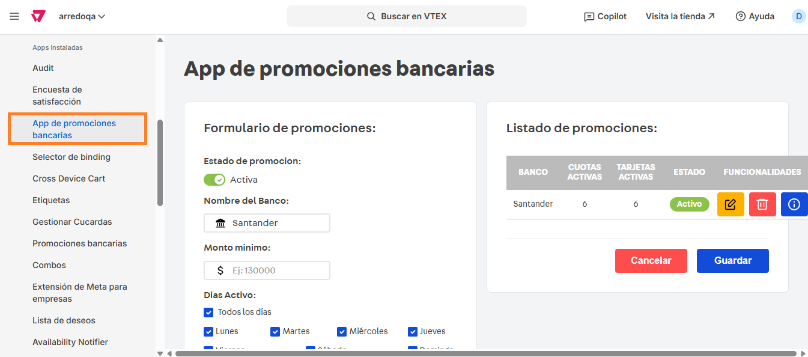
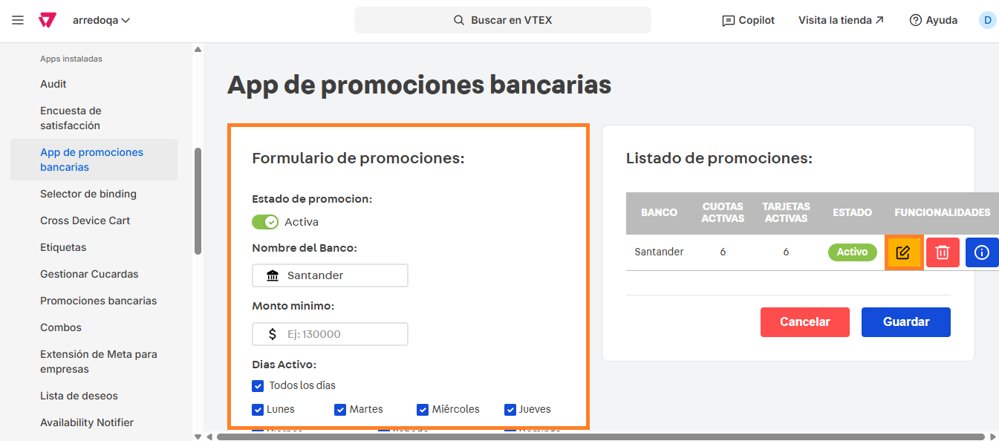

# 📌 App de promociones bancarias

## Descripción

Este componente permite crear promociones específicas de un banco, a partir de un monto mínimo aplicable y condiciones especiales de promoción, como pueden ser días activos, tarjetas y cuotas y fechas de aplicación.&#x20;

Una vez configuradas las promociones, en ficha de producto se mostrará la promoción más atractiva para ese producto para las condiciones establecidas y un CTA donde se pueden visualizar todas las promociones bancarias.

Por ejemplo: Si se configuran hasta 6 cuotas sin interés en productos desde $50.000 en todos los productos mayor a ese monto se mostrará esa cantidad de cuotas mientras que en aquellos que no cumplan con ese monto, se mostrará la siguiente promoción más atractiva.&#x20;

<figure><figcaption></figcaption></figure>

### Pasos para la configuración

1.  Ingresar a **Apps> Apps instaladas > App de promociones bancarias.**   

    <figure><figcaption></figcaption></figure>
2.  Al ingresar a la aplicación, veremos las promociones ya configuradas. Podemos ingresar a editar esas promociones o crear una nueva.  

    <figure><figcaption></figcaption></figure>
3. Dentro del formulario podemos configurar:
   1. **Estado de la promoción:** Activa o Inactiva
   2. **Nombre del banco:** Nombre de la promoción bancaria.&#x20;
   3. **Monto mínimo:** Completar en caso que deba cumplirse un monto mínimo para acceder a la promoción.
   4. **Días activo:** Se puede optar por seleccionar "Todos los días" o realizar una selección múltiple de los días en que se encuentra activa la promoción.&#x20;
   5.  **Tarjetas:** Se puede optar por seleccionar "Todas las tarjetas" o realizar una selección múltiple de las tarjetas a las que aplica la promoción.  

       <figure><figcaption></figcaption></figure>
   6. **Cantidad de cuotas:** Se puede optar por seleccionar "Todas" o o realizar una selección múltiple de las cuotas a las que aplica la promoción.&#x20;
   7.  **Fecha desde y hasta:** Se debe completar con el rango de fechas en los que aplica la promoción.  

       <figure><figcaption></figcaption></figure>
4. Al finalizar la carga, se debe hacer click en **Crear** para que la promoción quede guardada.&#x20;

