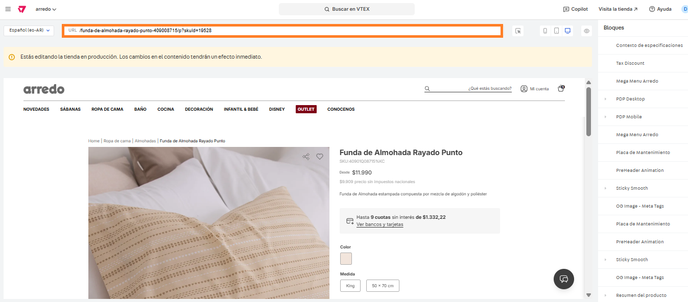
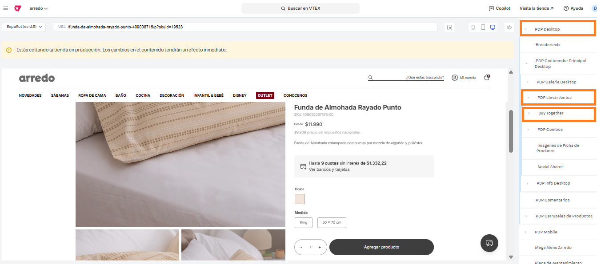
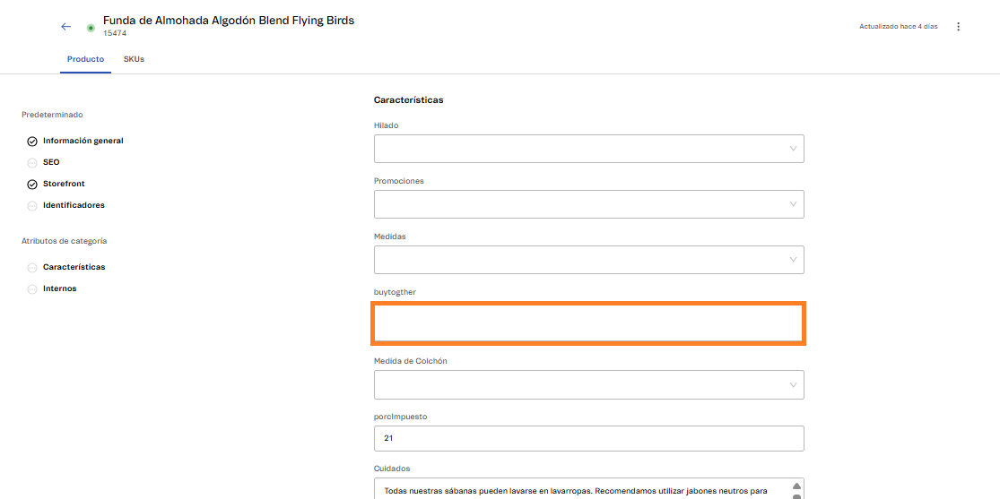

# 📌 Comprar juntos

### Descripción 

Este desarrollo permite mostrar en la ficha de producto, debajo de las imágenes del mismo, un bloque donde se sugieren productos adicionales, para comprar junto al que se está visualizando.

De esta forma se incentiva al usuario a llevar un producto extra al que se observa en ficha, obteniendo un descuento.

### Pasos para la configuración 

1. Acceder al administrador de VTEX.
2.  Ingresar por **Storefront** → **Site Editor** y dirigirnos a la URL de alguna ficha de producto.  

    <figure><figcaption></figcaption></figure>
3.  Al ingresar, debemos abrir el bloque PDP (Desktop o Mobile según cuál vayamos a editar) localizar el bloque llamado **PDP Llevar Juntos**, abrirlo e ingresar al llamado **Buy Together.** 

    <figure><figcaption></figcaption></figure>
4.  Desde el componente podemos encender o apagar el componente desde el switch, y también modificar la leyenda que figurará como título sobre el componente. 

    <figure><figcaption></figcaption></figure>

### ¿De dónde tomará el componente, el producto para mostrar como sugerencia? 

Se deberá crear una especificación a nivel producto llamada "Buy together" para cargar el SKU que se desea que figure como sugerencia.

<figure><figcaption></figcaption></figure>


Dentro de la especificación se debe colocar el ID del SKU. El componente solo toma un ID, por lo que no se debería cargar más de uno.


### Promoción para visualizar el descuento 

Además de cargar los productos que figurarán como sugerencia, se debe crear un promoción de tipo "Comprar Juntos" en Vtex. [Link Documentación](https://help.vtex.com/en/tutorial/buy-together--tutorials_323).&#x20;
