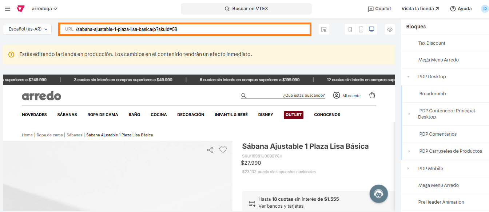
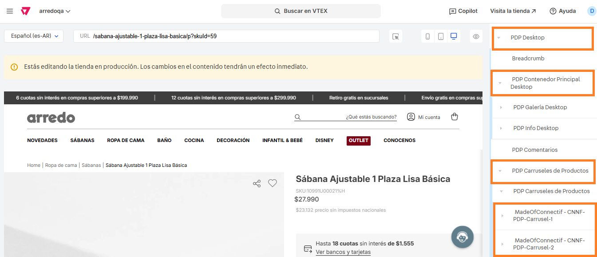

# 📌 Encendido y apagado de carruseles Connectif

## Descripción

Desde este componente se pueden encender o apagar la visualización de los carruseles de Connectif en la ficha de productos.

<figure><figcaption></figcaption></figure>

### Pasos para la configuración:

1. Ingresar a **Storefront > Site editor.**&#x20;
2. Para ingresar al bloque, nos dirigimos a alguna ficha de producto.

<figure><figcaption></figcaption></figure>

3. Al ingresar a la ficha, vamos a encontrarnos con los bloques PDP Desktop y PDP Mobile que contienen el resto de los bloques. Para este ejemplo vamos a abrir el bloque de desktop y abrir los bloques señalizados, dependiendo el bloque a encender/apagar ingresamos al carrusel 1 o 2.&#x20;

<figure><figcaption></figcaption></figure>

4.  Al ingresar al carrusel, contaremos con la opción de encender o apagar el componente y el resto de las opciones que pueden configurarse como en el resto de los bloques: Titulo, Tamaño tipográfico, grosor del titulo, etc.  

    <figure><figcaption></figcaption></figure>

    <figure><figcaption></figcaption></figure>
5. Una vez completas las opciones, hacemos click en **Guardar** para aplicar los cambios al sitio.&#x20;
