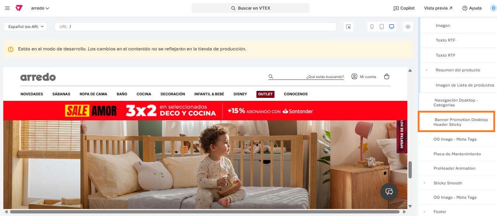

# 📌 Banner sticky

## Descripción

Este componente permite mostrar en PLP o landings custom un banner sticky de promociones que se mantiene fijo al scrollear. El mismo podrá ser programable y configureble al igual que el resto de los banners ingresando a cualquier PLP y cargando la información pertinente para cada una.

<figure><figcaption></figcaption></figure>

### Pasos para la configuración

1. Ingresar a **Storefront > Site editor.**&#x20;
2. Para ingresar al bloque, debemos ingresar a una PLP, buscar el bloque llamado **Sticky Smooth, abrirlo** y seleccionar el bloque llamado **Banner Promotion Header Sticky.**

<figure><figcaption></figcaption></figure>

3.  Al ingresar al bloque, podemos administrar si el bloque se encuentra encendido o apagado, así cómo también el banner que se va a visualizar. 

    <figure><figcaption></figcaption></figure>
4.  Si ingresamos al banner ya creado, podemos editar su título, imagen, URL, así como la fecha de inicio y fin y su recurrencia.&#x20;

    <figure><figcaption></figcaption></figure>

<figure><figcaption></figcaption></figure>

5. Una vez configurado el banner, hacemos click en **Guardar** para que apliquen los cambios.


Tener en cuenta que esta configuración debe realizarse tanto en desktop como en mobile.&#x20;

