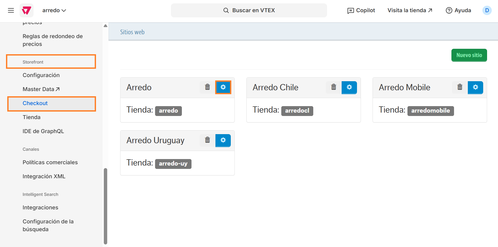
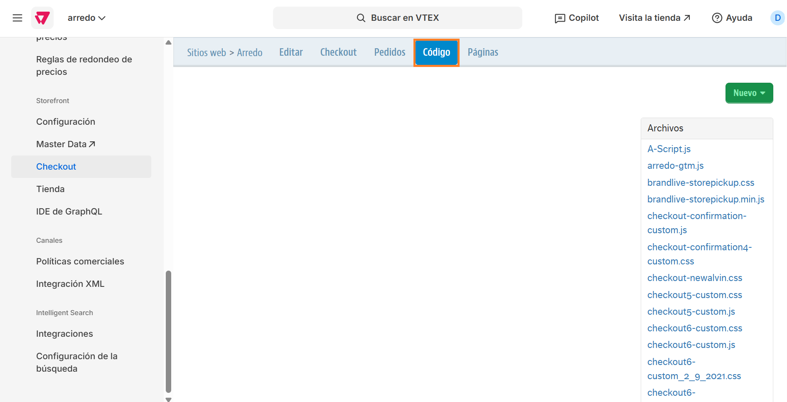
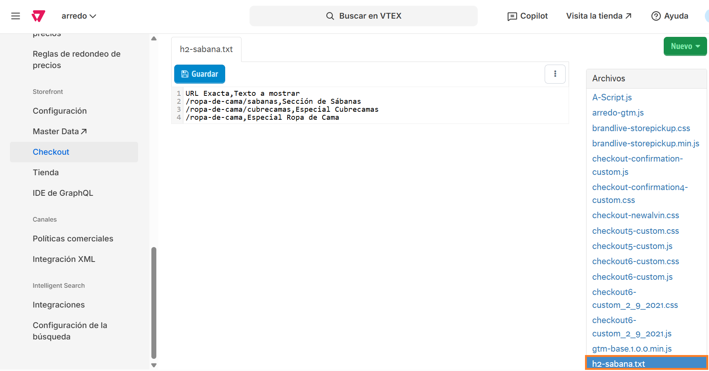
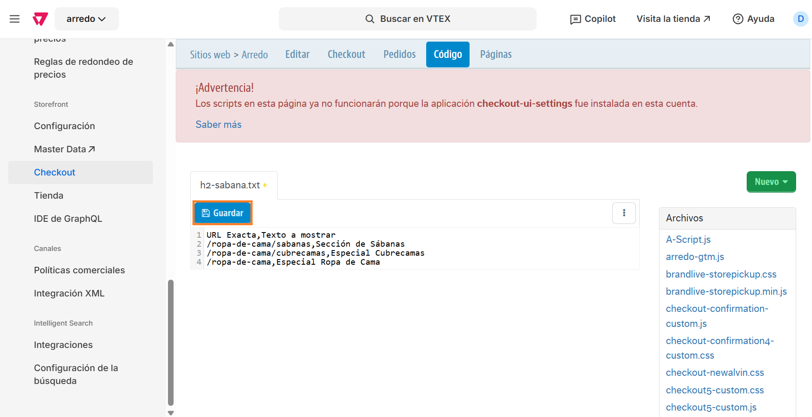

# 📌 Carga de H2 en PLP

## Descripción

Este componente permite asignar mediante un archivo en el checkout, un título con la etiqueta H2 en las distintas PLPs del sitio. El mismo valida si la URL declarada existe, y de ser así le inyecta el título dentro de la URL.&#x20;

### Pasos para la configuración

1.  Ingresar al administrador de VTEX y dirigirse a la sección de **Configuración en la tienda > Storefront > Checkout** y hacer click en la ruedita del sitio que querramos configurar. Para este ejemplo vamos a usar Arredo.  

    <figure><figcaption></figcaption></figure>
2.  Al ingresar, vamos a ir a la pestaña de **Código** 

    <figure><figcaption></figcaption></figure>
3.  Hacemos click en el archivo llamado **"h2-sabana.txt"** 

    <figure><figcaption></figcaption></figure>
4. Al ingresar al archivo nos encontraremos con un ejemplo de cómo debe cargarse la información dentro del archivo en la primera línea declarando:
   1. URL exacta: Se deberá completar con la URL a la cual queremos configurarle el H2. Por ej, **/ropa-de-cama/sabanas**
   2. Texto a mostrar: Se deberá completar con el texto que se renderizará en la PLP como H2. Por ej, **Sección de sábanas**.&#x20;


Información importante:&#x20;

* Formato a mantener: _URL, H2 (separado por comas)._&#x20;
* _Cada URL y H2 deberá separarse mediante un Enter, es decir, no puede haber en una misma línea más de una URL y H2._&#x20;


5.  Una vez configuradas todas las URLs, se habilitará el CTA **Guardar** y al hacer click comenzarán a renderizarse los textos en las distintas PLP.  

    <figure><figcaption></figcaption></figure>


Recordar que los cambios pueden demorar entre 5 a 10 minutos en reflejarse en el sitio.&#x20;

