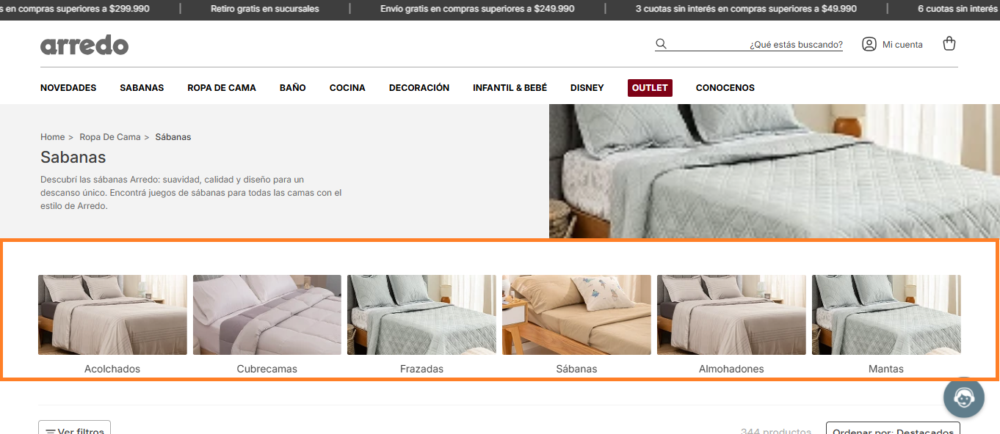
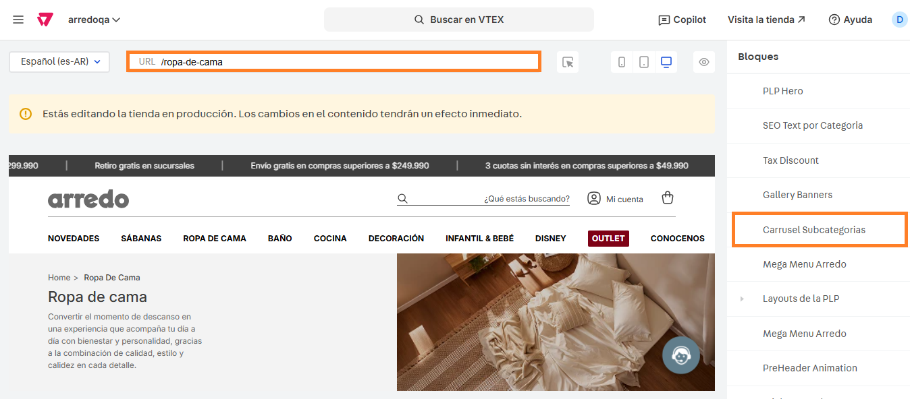

# 📌 Carrusel subcategorías

### Descripción 

Este componente permite crear un navegador en una categoría particular, mostrando subcategorías o colecciones y redirigiendo a las mismas mediante la URL.

Este navegador se puede crear con imagen y título o sólo título + la URL a la que redirigirá.

Aparece en páginas específicas en base a un patrón de URL definido en Site Editor.

<figure><figcaption></figcaption></figure>

### Pasos para la configuración

1. Ingresar a **Storefront > Site editor.**&#x20;
2.  Para ingresar al bloque, debemos ingresar a alguna PLP, buscar el bloque llamado **Carrusel Subcategorias** y seleccionarlo.  

    <figure><figcaption></figcaption></figure>

3. Al ingresar al bloque podemos visualizar las configuraciones del mismo:
   1. **Mostrar Componente?:** Desde esta opción se podrá administrar la visibilidad del carrusel.&#x20;
   2.  **Grupos de subcategorias:** Desde el botón **+Agregar** podemos sumar diferentes carruseles que se visualizarán en las PLP o colecciones asignadas. Si ingresamos a editar alguna podemos configurar:\
        

       <figure><figcaption></figcaption></figure>

       1. **Nombre del grupo**: Identificador para el Site Editor (no visible).&#x20;
       2. **ID de Categoría/Colección o URL:** Se deberá completar con el ID o ruta de la categoría o colección donde se mostrará el carrusel configurado.&#x20;
       3. **Ancho máximo del contenedor:** Porcentaje máximo que tomará el carrusel del ancho total de la pantalla. &#x20;
       4.  **Subcategorías:** Desde el botón **+Agregar** podemos configurar cada una de las slides que se mostrarán con sus configuraciones: 

           <figure><figcaption></figcaption></figure>

           1. **Nombre:** Identificador para el Site Editor (no visible).&#x20;
           2. **Imagen desktop y mobile:** Desde estas opciones se cargarán las imágenes que se visualizarán en el este item del carrusel.&#x20;
           3.  **Link destino:** URL a donde navegar al hacer click. 

               <figure><figcaption></figcaption></figure>
           4. **Titulo visible:** Desde aquí se debe cargar el título que se mostrará bajo la imagen en el item del carrusel.&#x20;
           5. **Activar analytics:** En caso de activar esta opción, se deben cargar las opciones de la promoción.
           6. **ID promoción:** Se debe completar con el identificador único de la promoción para GA.
           7.  **Nombre de la promoción:** Se debe completar con el nombre descriptivo de la promoción. 

               <figure><figcaption></figcaption></figure>

           Una vez completos todos los datos del item, aplicamos los cambios y volvemos al componente para continuar la configuración.&#x20;
   3. **Desktop, tablet y mobile:** En estos campos se debe completar el número de slides que se visualizarán a primera vista antes de utilizar las flechas de navegación.&#x20;
   4. **Visibiilidad de las flechas:** Se puede elegir entre que estén siempre o nunca visibles o sólo para desktop o mobile.&#x20;
   5. **Carrusel infinito (desktop):** Permite activar o no el carrusel infinito en desktop.&#x20;
   6. **Usar slider en mobile:** Permite activar o no el uso de slider en mobile.&#x20;
   7.  **Carrusel infinito (mobile):** Permite activar o no el carrusel infinito en mobile.  

       <figure><figcaption></figcaption></figure>

4. Una vez finalizada la configuración del carrusel, hacemos click en **Guardar** para que queden aplicados los cambios.
