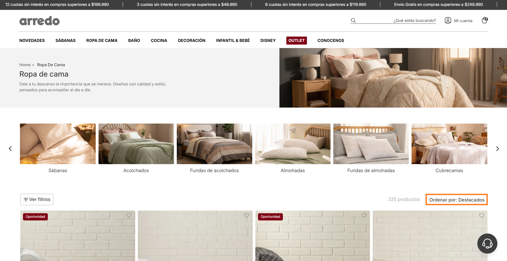
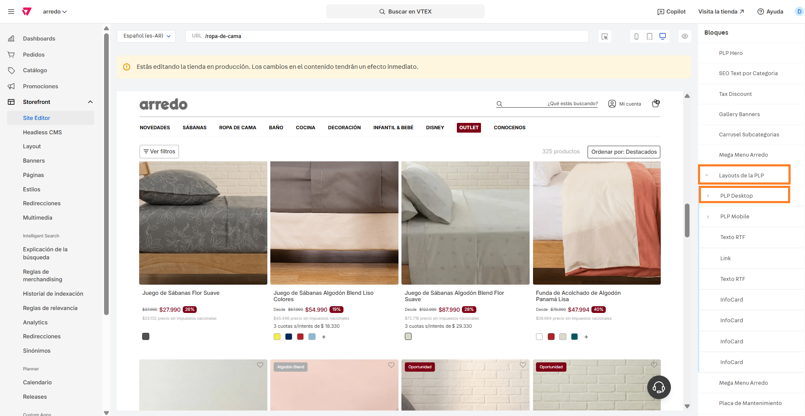
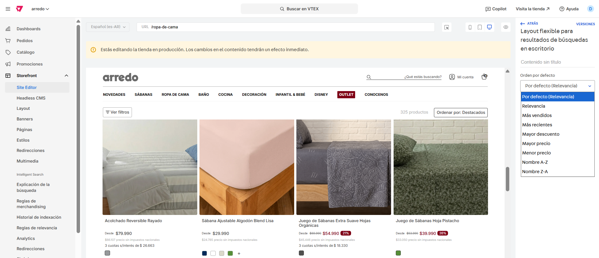

# 📌 Configurar filtro "ordenar por" en PLP

### Descripción 

Este componente permite modificar el orden en el que se muestran los resultados de la grilla en PLP comunes y especiales.  

<figure><figcaption></figcaption></figure>

### Pasos para la configuración

1. Ingresar a **Storefront > Site editor.**&#x20;
2.  Para ingresar al bloque, debemos ingresar a una PLP, buscar el bloque llamado **Layouts de PLP**, abrirlo y dependiendo que queramos editar e ingresar el bloque llamado **PLP Desktop.** 

    <figure><figcaption></figcaption></figure>
3.  Al ingresar, nos encontraremos con un selector que nos permitirá elegir cuál es el orden que utilizará la grilla para esa PLP.  

    <figure><figcaption></figcaption></figure>

4. Una vez modificado el filtro, se habilitará la opción **Guardar** para aplicar los cambios:

<figure><figcaption></figcaption></figure>
