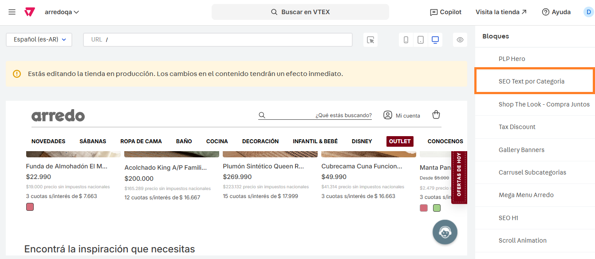
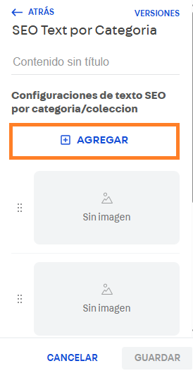

# 📌 Texto SEO por categoría

## Descripción

Este componente permite cargar un texto SEO por PLP que se visualizará al final de la grilla de productos.

<figure><figcaption></figcaption></figure>

### Pasos para la configuración

1. Ingresar a **Storefront > Site editor.**&#x20;
2.  Para ingresar al bloque, debemos buscar el bloque llamado **SEO Text por Categoría** y seleccionarlo.  

    <figure><figcaption></figcaption></figure>
3.  Al ingresar al bloque, desde el botón **+Agregar** podemos sumar el texto que se mostrará para cada PLP.  

    <figure><figcaption></figcaption></figure>
4. Al ingresar para agregar o editar alguno de los textos veremos los campos a configurar:
   1. **Nombre:** Se debe completar con el nombre identificador de la PLP a configurar. Esto no se visualizará en el componente.&#x20;
   2. **ID de categoría o colección:** Se debe completar con el ID de la categoría o colección donde se mostrará el texto. También se podrá completar con la URL específica, como por ejemplo: **/ropa-de-cama/sabanas.**
   3.  **Texto (HTML):** Aquí debe completarse con el texto que se visualizará en el componente. Tener en cuenta que este componente admite etiquetas HTML en caso que se necesario estilarlo con saltos de línea \  u otros estilos.  

       <figure><figcaption></figcaption></figure>
   4. **Color de fondo:** En caso de querer agregarle un color de fondo, se podrá completar con el hexadecimal que se desee (ej: #3E3E3E) o rgba (ej: 255,247,225,1).
   5. **Imagen de fondo desktop y mobile:** Desde estos campos se podrán sumar imágenes de fondo para desktop y mobile en caso de que se requiera.&#x20;
   6.  **Lineas visibles (ver más):** Desde esta opción podemos configurar en unidades la cantidad de lineas que se mostrarán de forma default antes de hacer click en **"Ver más".**  

       <figure><figcaption></figcaption></figure>
   7. Una vez aplicados todos los campos, hacemos click en **Aplicar** y al volver al componente hacemos click en **Guardar** para aplicar los cambios al sitio.&#x20;
