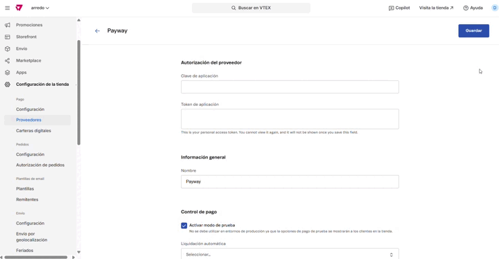

# 🔧 Proveedores

## Descripción

El módulo Pagos permite configurar varios proveedores de pago en tu tienda. De esta forma, puedes ofrecer diferentes métodos y condiciones de pago a tus clientes.

Cuando se realiza una compra en la tienda y el cliente realiza el pago, la transmisión de datos entre VTEX y el proveedor elegido se produce a través de protocolos de comunicación configurados en el VTEX Admin.

### Pasos para la configuración

A continuación se muestra un ejemplo de cómo configurar un proveedor de pagos:

1. En el administrador de VTEX, ingresar a **Configuración de la tienda > Pagos > Proveedores** o escribir **Proveedores** en la barra de búsqueda en la parte superior de la página.
2.  En la pantalla de proveedores, hacer clic en el botón **+Nuevo proveedor.** 

    <figure><figcaption></figcaption></figure>
3.  Escribir el proveedor de pago deseado en la barra de búsqueda y hacer clic en su nombre. 

    <figure><figcaption></figcaption></figure>
4.  Completar los campos disponibles según la información del proveedor de pagos con el que tiene contrato: 

    <figure><figcaption></figcaption></figure>

    1. Autorización del proveedor
       1. Clave de aplicación: Deberá completarse con la clave generada en VTEX para ese proveedor desde **Configuración de la cuenta > Claves de API.**&#x20;
       2. Token de aplicación: Deberá completarse con el token generado en VTEX para ese proveedor desde **Configuración de la cuenta > Claves de API.**&#x20;
    2. Control de pago
       1. Activar modo de prueba: Se deberá tildar sólo en casos donde se configuren credenciales de prueba.&#x20;
       2. Liquidación automática: Se podrá elegir entre las opciones:
          1. Utilizar comportamiento recomendado por el procesador de pagos
          2. Liquidación automática inmediatamente después de la autorización de pagos
          3. Liquidación automática inmediatamente después del análisis antifraude
          4. Desactivado
       3. Requires document: Se deberá tildar o no según la documentación del proveedor.&#x20;
    3. Campos del proveedor: Estos datos los deberá brindar el proveedor
       1. Site ID
       2. Api key public
       3. Api key privat
       4. Payment type
       5. Do you use Cybersource?
       6. Cuotas MiPyme
       7. Plan Z
       8. Límite de superior de captura permitido %
       9. Límite de inferior de captura permitido % 
    4. Haga clic en **Guardar**.
